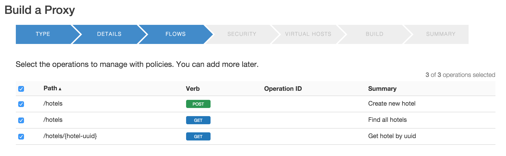

# Lab 1 – Design and Build a simple API Proxy

## Objectives

In this lab you will get familiar with the Apigee Edge Management UI by
creating a simple passthrough API Proxy to the GET API for the **hotels** API. After creating the proxy you will also
learn how to deploy and undeploy a proxy. Finally you will also learn
how to use the Trace capabilities in the Management UI.

## Prerequisites

- Postman tool installed and **DevJam 2.0** bundle imported.

## Introduction

An API is an interface between the provider of some backend system(s)
who wants to expose a set of services and the consumers of those
services who want to do something with them.

Many API providers describe their
APIs via informal mechanisms - for example a markdown document that shows typical requests and the responses. An alternative is to 
formally specify a “contract” for the interface, which  describes all  of the requests and responses in an interface, in a standard, machine-readable format. This isn't a new idea; it's been used in interface description languages in many frameworks, ever since the first two programs were hooked together. Formal specification of an interface has its advantages: using the description, tools can generate server stubs, client libraries, testing harnesses. 

There have been multiple proposed standards for describing APIs, but the most popular is called 
[*OpenAPI Specification*](https://openapis.org/specification) . (The OpenAPI Specification was formerly known as
Swagger).

An API described via an OpenAPI spec document allows the API provider and
the API consumer to agree on how the API behaves. It makes for quicker development and fewer surprises.

Apigee is a key contributing member of and has partnered with a number
of other companies to help drive the OpenAPI spec and contribute open
source software to the community.

This is a partial list of the tools that Apigee has created,
open-sourced, or contributed to related to API-first design, OpenAPI
spec, or API deployment:

-   [*apistudio.io*](http://apistudio.io/)    
In-browser OpenAPI
IDE including live documentation, code generation, mocking, and
cloud hosting.

-   [*A127*](https://github.com/apigee-127/a127-documentation/wiki)   
A toolkit for modeling and building rich, enterprise-class APIs in
Node.js on your laptop.

-   [*swagger.io editor*](http://editor.swagger.io)   
This web-based editor is the basis for the ones used in the above two projects, but it
also includes code generators for a number of other languages.

-  [apigee2openapi](https://github.com/anil614sagar/apigee2openapi)
A tool that generates an OpenAPI spec document from an existing API Proxy
defined in Apigee Edge. 

# Tasks 

For the purposes of illustration, we've created a specification describing an API that manages information about hotels. 

## Part 1: Brief Intro to OpenAPI Spec

1. Review the OpenAPI specification [document for the fictitious hotels service]
(http://playground.apistudio.io/9dd084db-7136-460e-8fe8-bde4ecafdc93/#/)  
http://playground.apistudio.io/9dd084db-7136-460e-8fe8-bde4ecafdc93/#/

2. On the right side of the editor, in the documentation view, scroll
down *about 65% of the page* to **GET /hotels** request.   Click the
**Try this operation** button:  

3. Click on Send Request and observe the response  

This shows you the basics of the online apistudio tool, and how it helps you to explore a specification document. 

3. Examine the left-hand-side of the browser page.  
This markup is called YAML - for Yet Another Markup Language. But it is possible to specify OpenAPI Spec documents using JSON as well. Explore the structure of the specification.  You don't have to learn it, but it is nice to understand what's possible. 

## Part 2: Create an API proxy in Apigee Edge

Using that OpenAPI specification, let's create an API proxy in Apigee Edge.

Apigee Edge enables you to expose and manage  PIs that can be easily consumed by
developers who build apps. You expose APIs on Apigee Edge by building
API proxies that act as proxies or facades for backend services.

### The API Proxy Concept

[Merriam Webster says](http://www.merriam-webster.com/dictionary/proxy) that a proxy is

> the agency, function, or office of a deputy who acts as a substitute for another

Within the domain of Apigee Edge, an API Proxy is something that acts as a substitute
for the actual API implementation, sometimes called a "backend". Instead of clients directly connecting to a backend API, a client will connect to an API Proxy that runs in Apigee Edge, and Apigee Edge will connect to the backend API.

*Why Proxy?* The proxy obviously adds an extra layer, an extra network hop. Why do it? By adding this layer,

* ...you gain a level of control and insight into the inbound API requests. The proxy can verify security tokens, collect analytics information, serve requests from cache, perform traffic management, ... all without changing the backend API. 

* ...you gain insight into the API usage.

* ...you decouple the developer-facing API from the API exposed by 
backend services. This brings several advantages:

  * it shields "consumer developers" - those who are using the APIs - from changes in backend code or implementation.  As development teams make backend changes, consumer developers
continue to call the same API without any interruption.

  * it enables you, the API Provider, to innovate at the edge without impacting internal applications and
development teams. Edge acts as a *service virtualization* layer. For example For example, you could convert an XML-based API to a JSON-based API just by introducing a few rules in the proxy configuration, without changing any backend code. You could introduce new services that compose multiple backend services. 

In short, the API Proxy metaphor enables *API Management*.

### Describing an API Proxy 

In Apigee Edge, an API proxy is described by a set of configurations, usually specified in a bundle of XML configuration files.
These configuration files will stipulate what inbound requests the proxy listens for (all of them?  just those on url path /v1/service ?), whether to use TLS (we hope so) and if so, which ciphers to use, whether to use caching, how to verify API keys, and so on.  All of these basic things
can be done with simple configuration of Apigee Edge capabilities. No coding. 

Apigee Edge also allows people to extend the capabilities with custom code. For example, if you would like to design an API Proxy that performs custom augmentation of the response received from the backend, you could do that by writing some JavaScript. 

The configuration 
and any custom code you provide (such as
JavaScript and Java), hosted in Apigee Edge, implements the facade for your backend HTTP
services.

### How an API Proxy works in Apigee Edge

API proxies in Apigee Edge manage request and response messages using a 'pipeline'
processing model.  A request arrives in Edge, and according to the configuration you provide, a series of steps operates on the inbound message. Check for a key. Enforce a Quota, transform a message, and so on.  You customize the behavior of your
API Proxy by attaching Policies (or logical processing steps) to request and response Flows.

In an API proxy configuration, there are two types of *endpoints*:

- **ProxyEndpoint**  
This is the inbound endpoint. The configuration attached to the ProxyEndpoint manages requests arriving from apps
that consume your API. You configure the ProxyEndpoint to define
the base URL path of your API. You usually attach Policies to the
ProxyEndpoint to enforce security, quota checks, and other types
of access control and rate-limiting.

- **TargetEndpoint**  
This is the outbound endpoint. The configuration for the TargetEndpoint manages interactions with
your backend services on behalf of consumer apps. You configure
the TargetEndpoint to forward request messages to the proper
backend service. You usually attach Policies to the TargetEndpoint
to ensure that response messages are properly formatted for the
app that made the initial request.

See the graphic below, showing a basic
request and response exchange between an app (HTTP client) and a backend
service is managed in an API proxy by a ProxyEndpoint and
TargetEndpoint.

You can interactively build API proxies using the Apigee Edge management UI. You can store proxy configurations offline (and in a code repository), and then import them
into Apigee Edge, using... *an API*. Apigee Edge itself exposes an API for management and administrative purposes. 

For an overview of the Edge UI and API,
see [Using the Apigee Edge development
environment](http://apigee.com/docs/api-services/content/using-apigee-edge-development-environment).

## Note

Some API teams build APIs using Design-First approach where they start
with creating a Swagger (OpenAPI) document. Some of them happen to have
many existing back-end services/APIs & they prefer a Build-First
approach which starts with building an API proxy in Apigee Edge. This
lab shows you how to build proxies.

###Estimated Time: 15 mins

* Creating an API Proxy for a backend service that you want to expose requires you to provide the network address for the backend service, along with some information that API Services uses to model the API that will be exposed to developers.
    * Open up a browser tab and log in to [*http://enterprise.apigee.com*](http://enterprise.apigee.com)
    *  From the Organization drop-down in the top-right corner, select the organization assigned to you.
    *  From the Environment drop-down, select **test**
    *  From the main menu, select APIs → API Proxies

 > 

    * To create a new API proxy, select the + API Proxy button to add a new proxy.

 > 

    * On the New API Proxy form that is displayed, provide information needed to generate an API proxy. Select **Reverse Proxy** and click on **Use OpenAPI** -

 > 

    * Put in the URL:
   [*http://playground.apistudio.io/9dd084db-7136-460e-8fe8-bde4ecafdc93/spec*](http://playground.apistudio.io/9dd084db-7136-460e-8fe8-bde4ecafdc93/spec)
    and click on ***apply*** and then hit ***next***

 > 

    * Enter Proxy details

 > 

    > Proxy Name: **{your\_initials}\_hotels**
    >
    > Project Base Path: **/v1/{your\_initials}\_hotels**
    >
    > Existing API:
    > **https://api.usergrid.com/{your-BaaS-org}/sandbox**

**Note**: Replace **{your-BaaS-org}** with the actual name of your API BaaS organization. Replace **{your-initials}** with the initials of your name.

Once you've entered these details hit next.

   * Leave all of the **operations** selected from the OpenAPI spec to proxy and hit next

> 

   * Choose **Pass through (none)** for the authorization in order to choose not to apply any security policy for the proxy (this will be done in the later labs) and hit next

> 

   * Select only the **default** virtual host (http only) and hit next

> 

   * Ensure that only the **test** environment is selected to deploy to and click **Build and Deploy**. Once it has built and deployed click the link to view your proxy in the proxy editor.

> 

* **Deploying and Undeploying a Proxy** to a given environment from the Management UI is simple too.
    * Click on the **Deploy** drop-down on the API Proxy page.

    > 

  * Notice that the proxy we just created is deployed to the **test** environment.
  * Click on the **test** environment name. This undeploys the proxy from the **test** environment
  * Click on the **Deploy** drop-down again and select the **test** environment. This re-deploys the proxy to the **test**
    environment

*  **Tracing the execution of a proxy** can also be done easily from the Management UI. This is a very powerful capability of the product since it makes it easy to troubleshoot and monitor API  proxies running on Apigee Edge. Trace lets you probe the details of each step through an API proxy flow.
    *  From the **{your\_initials}**\_hotels API Proxy page, click on the **Trace** tab.

    > 

    * Once on the **Trace** tab, pick the correct environment from the **Deployment to Trace** drop-down. In your case there should only be one environment to pick - **Environment test, Revision 1**.

    > 

    * Add **/hotels** to the end of the URL  
    * Click on the **Start Trace Session** button.
    * After the trace session starts, click on the **Send** button in the **Send Requests** section.

    > 

    * You will see the a transaction appear in the **Transactions** section and a visual representation of the executed proxy flow in the **Transaction Map** section.
    * The **Transaction Map** is interactive - click on the various execution steps within the flow and review the information provided in the **Phase Details** section. You will notice that for each step information such as headers, variables, payload, properties and other relevant information is available. This helps you quickly understand exactly what is happening within the proxy flow.

> 

  * At this point, we will start to use the **Postman** tool as a client to invoke our proxy and continue to use **Postman** throughout the rest of the labs.
      * Launch **Postman**
      * Select the **DevJam 2.0** environment.
      > 
      * Open the **DevJam 2.0** project
      * Select and send the **/GET hotels** request.

      > 

**Note** : Please change the URL to point to your API proxy.

Review the response returned by the proxy. It should be the same response as the one you observed when using the **Trace** tool in the Management UI. Switch to the **Trace** tab of the Apigee Edge Management UI and click on the **Stop Trace** button.

##Summary

That completes this hands-on lesson. Simple and quick, but you learned the fundamentals of how to create an API Proxy, how to deploy and undeploy it to/from an environment, and how to trace the proxy flow. Throughout the rest of the hands-on labs you will be working with this Management UI to add policies to proxies, testing and tracing these proxies, and learning about the power of the Apigee Edge platform.
