#Lab 2 - Traffic Management for APIs


## Objectives

The goal of this lesson is to introduce you to Traffic Management
policies and applying a couple of these policies to the API Proxy you
created in the previous lesson.

The total estimated time required for this exercise: 30 minutes.

## Pre-Requisites
-   Lab 1 is completed

## Background

To maintain performance and availability across a diverse base of client
apps, it's critical to maintain app traffic within the limits of the
capacity of your APIs and backend services. It's also important to
ensure that apps don't consume more resources than permitted.

Apigee Edge provides three policies that enable you to optimize
traffic management to minimize latency for apps while maintaining the
health of backend services.

> NB, a policy in Apigee Edge is a unit of re-usable logic that performs
a certain task. There are policy types for transforming messages,
caching data, checking tokens or keys, creating tokens, and so on.

Each of the traffic management policy types addresses a distinct aspect
of traffic management. In some cases, you might use the three policy
types in a single API proxy.

In addition, Apigee Edge includes a cache, that can also be accessed via
policies, to manage traffic and handling of requests. 


### Spike Arrest 

This policy smoothes traffic spikes by dividing a limit that you define
into smaller intervals. For example, if you define a limit of 100
messages per second, the Spike Arrest policy enforces a limit of about 1
request every 10 milliseconds (1000 / 100); and 30 messages per minute
is smoothed into about 1 request every 2 seconds (60 / 30). The Spike
Arrest limit should be close to capacity calculated for either your
backend service or the API proxy itself. The limit should also be
configured for shorter time intervals, such as seconds or minutes. This
policy should be used to prevent sudden traffic bursts caused by
malicious attackers attempting to disrupt a service using a
denial-of-service (DOS) attack or by buggy client applications.  See
[SpikeArrest](http://docs.apigee.com/api-services/reference/spike-arrest-policy).

### Quota 

This policy enforces consumption limits on client apps by maintaining a
distributed 'counter' that tallies incoming requests. The counter can
tally API calls for any identifiable entity, including apps, developers,
API keys, access tokens, and so on. Usually, API keys are used to
identify client apps. This policy is computationally expensive so, for
high-traffic APIs, it should configured for longer time intervals, such
as a day or month. This policy should be used to enforce business
contracts or SLAs with developers and partners, rather than for
operational traffic management.  See [Quota](http://docs.apigee.com/api-services/reference/quota-policy).

### Concurrent Rate Limit

This policy enables traffic management between API Services and your
backend services. Some backend services, such as legacy applications,
may have strict limits on the number of simultaneous connections they
can support. This policy enforces a limit on the number of requests that
can be sent at any given time from API services to your backend
service. This number is counted across all of the distributed instances
of API Services that may be calling your backend service. Policy limits
and time duration should be configured to match the capacity available
for your backend service.  See [Concurrent Rate Limit](http://docs.apigee.com/api-services/reference/concurrent-rate-limit-policy).


### Caching Policies

Apigee Edge supports different caching policies enabling you to:

* Reduce latency: A request satisfied from the cache gets the
  representation and displays it in a shorter time. The server is more
  responsive with requests satisfied from the cache, which is closer to
  the client than the origin server.

* Reduce network traffic: Representations are reused, reducing the
  impact of processing duplicate or redundant requests. Using a cache
  also reduces the amount of bandwidth you use.

* Persist data across transactions: You can store session data for reuse
  across HTTP transactions.

* Support security:You may need "scope" access to the contents of a
  cache so it can only be accessed in a particular environment or by a
  specific API proxy.

The various caching policies supported by Apigee Edge are:

| Policy name    | Description |
| :------------- | :---------- |
| ResponseCache | Uses a cache to cache the response  from the backend resource. This reduces the number of requests to the resource. When the response is already available in cache, it is returned directly by Edge, without contacting the backend.  [ResponseCache policy](http://apigee.com/docs/api-services/reference/response-cache-policy). |
| PopulateCache | Write arbitrary data, not necessarily response content, to the cache. You can use composite keys for the cache, so that you could cache user information, client information, Nonces, and so on. Each cache item can be tagged with an individual Time-to-Live, so data can be available for 10 seconds or 10 hours or 10 days, etc. [PopulateCache](http://apigee.com/docs/api-services/reference/populate-cache-policy). |
| LookupCache | Retrieve values that have been cached with the PopulateCache policy. [LookupCache](http://apigee.com/docs/api-services/reference/lookup-cache-policy). |
| InvalidateCache | Purges values that have been cached by PopulateCache. [Invalidate Cache policy](http://apigee.com/docs/api-services/reference/invalidate-cache-policy). |


## Part 1: Adding a Spike Arrest Policy

**Estimated Time: 6 minutes**

1. Go to the Apigee Edge Management UI browser tab.

2. Ensure you're viewing the list of API Proxies.  If not, Use the upper navbar to select "API Proxies".  


3. From the list of proxies, Click the name of *your* API proxy.

4. Click on the develop tab.  


5. Click on Proxy Endpoints &gt; PreFlow.  
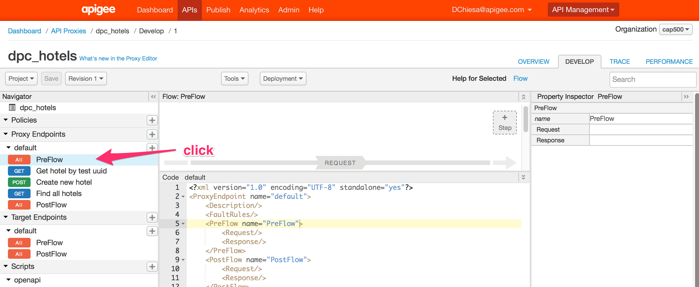

  Each proxy has a number of different places at which developers can
  attach policies. You can specify that your policies will run during
  request processing, or during response processing - *Request flow* or
  *Response flow* in Apigee parlance. For each of those, you can set up
  conditions to apply policies to a subset of cases - for example a
  condition will typically match a url path and verb.  `GET /hotels`
  might have a conditional flow. There is also a "preflow" and
  "postflow" which act like wildcards - the policies attached here will
  run all requests on this proxy, before or after any conditional flow,
  respectively.

6. Click on `+ Step` on the Request Flow.  
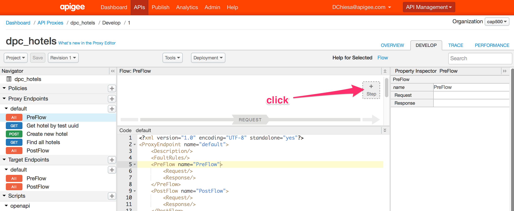

  By doing this, you are adding a policy step that will run in the
  Request Pre-flow. It will run for all inbound requests.


7. Select the ‘Spike Arrest’ policy with the following properties:

      > Display Name: **Spike Arrest 10pm**

      > Name: **Spike-Arrest-10pm**

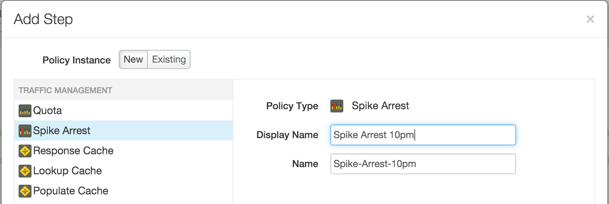

**Note**: By applying the policy to the Flow PreFlow, this Spike Arrest policy will get enforced for all the resources defined for this
Proxy.
    * Click on the “Spike Arrest” policy and change the value of the following property in the XML:


**NOTE:** The value was changed from 30 per second to 10 per minute.

   * Save the changes to the proxy and ensure that it is deployed successfully to the ‘test’ environment. Your configuration should look like this -
```
<?xml version="1.0" encoding="UTF-8" standalone="yes"?>
<SpikeArrest async="false" continueOnError="false" enabled="true" name="Spike-Arrest-10pm">
    <DisplayName>Spike Arrest 10pm</DisplayName>
    <Properties/>
    <Identifier ref="request.header.some-header-name"/>
    <MessageWeight ref="request.header.weight"/>
    <Rate>10pm</Rate>
</SpikeArrest>
```

Think of Spike Arrest as a way to generally protect against traffic
spikes (system wide) rather than as a way to limit traffic to a
specific number of requests for certain users. Your APIs and backend
can handle a certain amount of traffic, and the Spike Arrest policy
helps you smooth traffic to the general amounts you want.

The runtime Spike Arrest behavior differs from what you might expect
to see from the literal per-minute or per-second values you enter.

For example, say you enter a rate of 30pm (30 requests per minute). In
testing, you might think you could send 30 requests in 1 second, as
long as they came within a minute. But that's not how the policy
enforces the setting. If you think about it, 30 requests inside a
1-second period could be considered a mini spike in some environments.

What actually happens, then? To prevent spike-like behavior, Spike
Arrest smooths the allowed traffic by dividing your settings into
smaller intervals:

**Per-minute** rates get smoothed into requests allowed intervals of
**seconds**. For example, 30pm gets smoothed like this: 60 seconds
(1 minute) / 30pm = 2-second intervals, or about 1 request allowed
every 2 seconds. A second request inside of 2 seconds will fail.
Also, a 31st request within a minute will fail.

**Per-second** rates get smoothed into requests allowed in intervals
of **milliseconds**. For example, 10ps gets smoothed like this:
1000 milliseconds (1 second) / 10ps = 100-millisecond intervals,
or about 1 request allowed every 100 milliseconds . A second
request inside of 100ms will fail. Also, an 11th request within a
second will fail.

* **Testing the Spike Arrest Policy** Use Postman to quickly send more than 2 requests in 6 seconds and observe that certain requests will receive an error with the errorCode “policies.ratelimit.SpikeArrestViolation”

* **Adding Response Cache Policy** Reduce external service calls, reduce network traffic and improve performance
   * Go to the Apigee Edge Management UI browser tab.
   * Select your API proxy.
   * Click on Proxy Endpoints -&gt; PreFlow
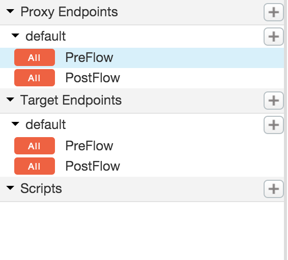
   * Click on “+ Step” on the Request Flow.
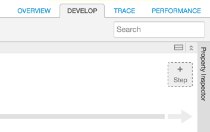
   * Select the ‘Response Cache’ policy with the following properties:

   >  Policy Display Name: **Cache Hotels Data**

   >  Policy Name: **Cache-Hotels-Data**

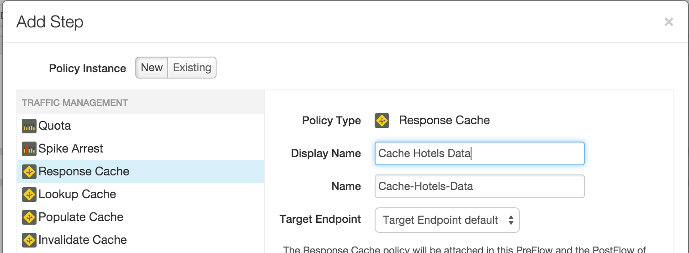

   * Once the ‘Cache Hotels Data’ policy appears, review its properties (click on the policy). Since everything else except the name was left as a default, you will notice that the Expiration Timeout in Seconds is set to 3600 (i.e. 1 hour).
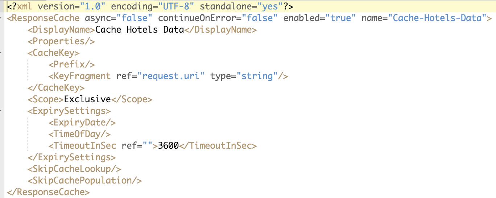

The timeout property along with other properties should be modified as per your use cases. For policy reference information, see [ResponseCachepolicy](http://apigee.com/docs/api-services/reference/response-cache-policy).

The Response Cache policy needs a Cache Resource that can be used to cache the data. Apigee Edge provides a default cache resource that can be used for quick testing, which is what is being used in this lesson. The Cache Resource to be used by Response Cache policies should also be created and configured as per your use cases. For Cache Resource configuration information, see [Manage Caches for an Environment](http://apigee.com/docs/api-services/content/manage-caches-environment).
   * Your Proxy Endpoints → Default → PreFlow should look as follows:
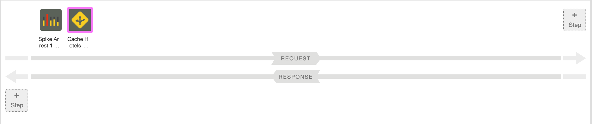
   * Your Target Endpoints → Default → PostFlow should look as follows:
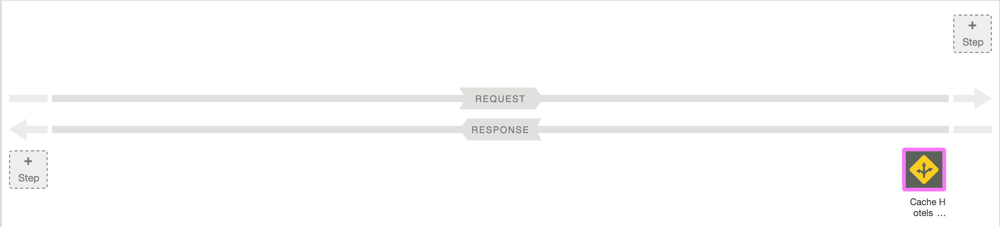
   * Save the changes to the API Proxy, wait for it to successfully deploy.

* **Testing the Response Cache Policy** Start the API Trace and send a test ‘/GET hotels’ request from Postman with the following query parameters:

   > zipcode=98101&radius=200

**NOTE:** Before invoking, please change the URL to point to your API proxy.

 <span id="h.3znysh7" class="anchor"></span>

   * Wait for 6 to 10 seconds (to avoid the Spike Arrest policy from stopping your requests) and send the same request again from Postman.
   * Go back to the Trace view and review the transaction map of both the requests including the overall elapsed time to process both requests.

The first transaction map should look as follows:
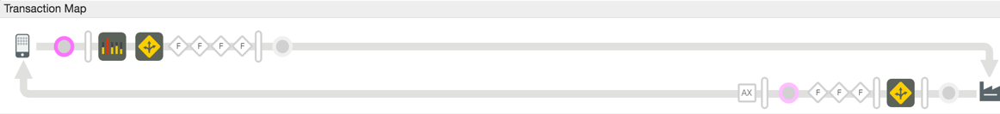

The second execution flow should look as follows:

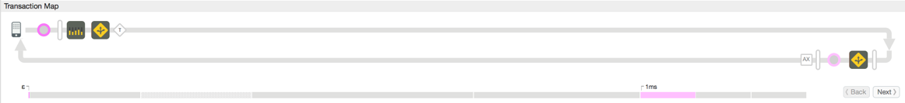

After configuring the Response Cache policy, as expected, after the initial request, the second and all other requests for the next 3600 seconds will be served from the cache and hence avoid executing any other policies. Since the service callout, target service and other transformation policies are not executed, the overall transaction time has also dropped significantly.

##Summary
That completes this hands-on lesson. You learned how to use the Spike Arrest to protect the environment from traffic spikes and to use the Response Cache policy to provide a better overall experience for the API consumer while reducing network traffic. Obviously like any other policy, these policies must be used appropriately based upon your use cases.
