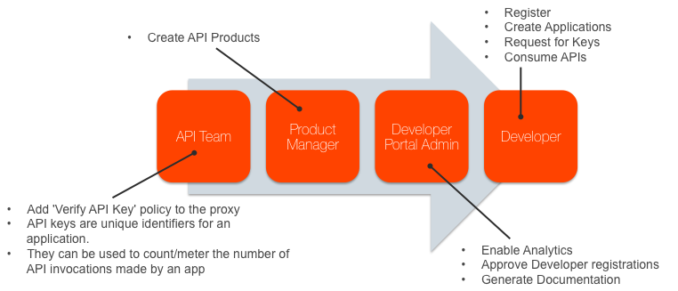
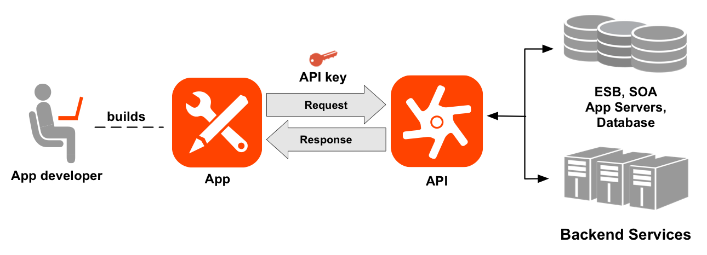
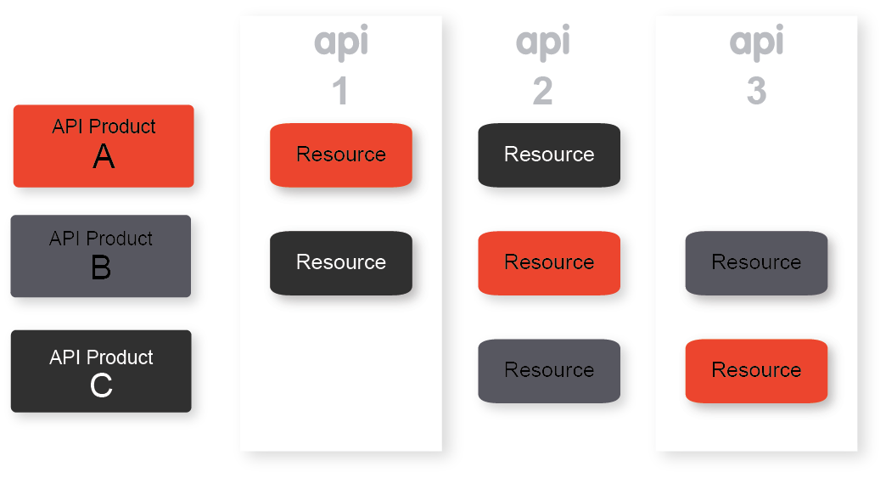
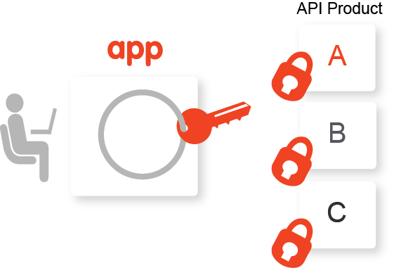

# Lab 3 – Publish APIs


## Objectives

The goal of this exercise is to publish the APIs that are being managed in Apigee Edge. 

Publishing APIs can be broadly defined by the following tasks:

1.  Create the API products on Edge that bundle your APIs.
2.  Register app developers on Edge.
3.  Register apps on Edge.
4.  Provide documentation and community support for your APIs,
    including:
    -   API reference documentation
    -   Examples and tutorials
    -   Forums, blogs, and other features to foster the developer
        community

In this exercise, we'll do all of these things.



The total estimated time required for this exercise: 60 minutes.

## Pre-Requisites

-   At a minimum, Lab 1 is completed
-   A developer portal is provisioned


## Part 1: Adding API Key Verification

A *developer* builds an *app* that makes requests to your *APIs* to
access your backend services. The following image shows the relationship
of a developer to an app and to an API:



**Estimated Time: 5 minutes**

1. Go to the Apigee Edge Management UI browser tab.

2. Ensure you're viewing the list of API Proxies.  If not, Use the upper navbar to select "API Proxies".  


3. From the list of proxies, Click the name of *your* API proxy.

4. Click on the develop tab


5. Click on Proxy Endpoints -> PreFlow


6. Click on “+ Step” on the Request Flow
  
  
  You will see the familiar modal dialog:
  
  
7. Scroll down and Select the **Verify API Key** policy, and click the "Add" button. 

  You will then be back in the Develop page.  You will see that **Verify
  API Key** policy has been added after the ‘Response Cache’
  policy. Like so:
  

  **Click-and-Drag** the **Verify API Key** policy to move it so
  that it appears before the ResponseCache policy. 
  

  **Note**: It depends on your use case, but typically API Key
  (or token) verification should be one of the first policies in the flow. In this
  scenario, we verify the API Key before the Response Cache policy to
  ensure that an API Consumer whose API Key may have been revoked is not
  able to get the data from the cache.

8. Ensure you have the correct policy selected. Your view should be like so:


9. Configure the VerifyApiKey policy XML like so:
  ```xml
  <VerifyAPIKey name="Verify-API-Key-1">
      <DisplayName>Verify API Key-1</DisplayName>
      <APIKey ref="request.queryparam.apikey"/>
  </VerifyAPIKey>
  ```
  
  (You can cut-and-paste the above into the policy XML editor)

  Note the `&lt;APIKey&gt;` element, which identifies where the policy
  should check for the API key. In this example, the policy looks for
  the API key in a query parameter named 'apikey'. API keys can be
  located in a query parameter, a form parameter, or an HTTP header.
  You need only to use a difference expression to reference an apikey in these different locations.
  For example, `request.header.key` or `request.formparam.apikey`. Also, it doesn't have to be named "apikey". Name it whatever you like. 

  For more, see [the documentation on the Verify API Key
  policy](http://apigee.com/docs/api-services/reference/verify-api-key-policy).


## Part 2: Removing the API Key from the query string

**Estimated Time: 3 minutes**

Apigee Edge acts as an http proxy.  If all of the traffic management and key
verification policies pass, then a *copy of* the inbound request is sent
to the backend. This includes all of the headers and query parameters
that were originally sent in.  In many cases you'd like to modify the
copy of the request message before it gets proxied to the backend -
for example, you may wish to inject a header with some client
information.  In this case, we will remove information from the
request; we will remove the API Key.  The API Key should be considered
a secret, and need not be sent to the backend. 


1. In the API Proxy Editor, Click on “+ Step” on the Request Pre-Flow.  
  

2. From the modal, scroll and select the ‘Assign Message’ policy. Click
  "Add". You will now see something like the following:  
  


3. Click-and-drag the AssignMessage policy so that it appears before the
  Response Cache policy:  
  

3. Now, verify that you have selected the appropriate policy.  
  

4. Replace the policy XML for the AssignMessage policy with the following:
  ```xml
  <AssignMessage name="Remove-APIKey-QP">
    <DisplayName>Remove APIKey QP</DisplayName>
    <Remove>
      <QueryParams>
        <QueryParam name="apikey"></QueryParam>
      </QueryParams>
    </Remove>
    <IgnoreUnresolvedVariables>true</IgnoreUnresolvedVariables>
    <AssignTo createNew="false" transport="http" type="request"/>
  </AssignMessage>
  ```
  
  This tells Apigee Edge to remove the queryparam "apikey" from the copy
  of the request message that will be sent to the backend.  You could
  also use this policy to remove other information, or to insert
  information into the request. 
    
7. **Save** the API proxy configuration.  
  


## Part 3: Testing API Key Verification

**Estimated Time: 4 minutes**

Until now anyone with the URL to the ‘{your\_initials}\_hotel’ API Proxy
has been able to make a request and get a valid response back (assuming
appropriate input parameters like zipcode and range, of course). Now
that you have added the API Key Verification policy, that will no longer
be the case. Let's check it out.

1. In the Edge UI, select the Trace tab.


2. Start the Trace session for the ‘**{your\_initials}**\_hotels’
proxy. 

3. Use your Postman client to send a `/GET hotels` request. Use the following
  query parameters: `zipcode=98101&radius=200`

4. In Postman, examine the response. The following fault is returned
  since an API Key has not been provided as a request query parameter:

  ```json
  {
    "fault": {
      "faultstring": "Failed to resolve API Key variable request.queryparam.apikey",
      "detail": {
        "errorcode": "steps.oauth.v2.FailedToResolveAPIKey"
      }
    }
  }
  ```

  The above response shows that the API Key Verification policy is being enforced as expected.

5. Use your Postman client to send another `/GET hotels` request. Use the following
  query parameters: `zipcode=98101&radius=200&apikey=abcdefg`

  This passes an invalid API Key. Examine the response in Postman. It's similar, but not the same. 
  
  NB: It is possible to customize the fault messages that are sent back by Apigee Edge
  when a key is not present, or is invalid. 


6. Return to the Trace screen in the Edge UI.  Click through the
  transactions, and you will see that the Verify API Key policy is
  returning the fault, as expected. 

7. Stop the Trace session for the proxy

Before we can check the positive case, in which the Verify API Key
policy succeeds, we need to issue an API Key. And for that, we need an
API Product. 


## Part 4: API Products

**Estimated Time: 4 minutes**

In Apigee Edge, the API Product  is the unit of exposure.  You should
think of API Proxies as the *unit of execution* and API Products as the *unit of
exposure*.  The Proxy is where you define which operations should occur on
requests and responses. The Product is the thing that consuming developers
get authorization for. 

A simple way to think of an API Product is as a bundle of one or more API
Proxies, along with some meta-data.  For example, the metadata might include a
quota threshold, or a cache lifetime, or a list of data fields to include or
exclude from the response. 

API products enable you to bundle and distribute your APIs to multiple classes
of developer (eg, Gold, SIlver, Bronze) simultaneously, without having to modify
code. An API product consists of a list of API resources (URIs) combined with a
Service Plan (rate-limiting policy settings) plus any custom metadata required
by the API provider. API products provide the basis for access control in
Apigee, since they provide control over the set of API resources that apps are
allowed to consume.



As part of the app provisioning workflow, a developer selects from a list of API
products. This selection of an API product is usually made in the context of a
developer portal. The developer app is provisioned with a key and secret
(generated by and stored on Apigee Edge) that enable the app to access the URIs
bundled in the selected API product. To access API resources bundled in an API
product, the app must present the API key issued by Apigee Edge. Apigee Edge
will resolve the key that is presented against an API product, and then check
associated API resources and quota settings.

The API supports multiple API products per app key - your developers can consume
multiple API products without requiring multiple keys. Also, a key can be
'promoted' from one API product to another. This enables you to promote
developers from 'free' to 'premium' API products seamlessly and without user
interruption. They can continue to use the same key. 

The following table defines some of the terms used to register apps
and generate keys:

| Entity      | Description |
| :---------  | :--------   |
| API product | A bundle of API proxies combined with a service plan that sets limits on access to those APIs, as well as other metadata. API products are the central mechanism that Apigee Edge uses for authorization and access control to your APIs. For more, see [API Products](http://apigee.com/docs/developer-services/content/what-api-product) |
| Developer   | The API consumer. Developers write apps the make requests to your APIs. The developer gets authorization to use one or more *API Products*. |
| App         | A client-side app that a developer registers to access an API product. Registering the app with the API product generates the API key for accessing the APIs in that product. |
| API key     | An opaque string that is generated and stored by Apigee Edge. This key is shared between the app developer and Edge. The app typically sends the API key in with each request, to allow Edge to verify the request. The key is a secret. The API key is generated when a registered app is associated with an API product. |

Now, let's create an API Product within Apigee Edge. 

1. From the Apigee Edge Management UI, click the upper navbar to Publish → Products


2. Click on ‘+ Product’ button to add a new API Product


3. In the ‘Product Details’ section of the new product screen, enter or select the following values for the various fields:

  * Display Name: **{Your_Initials}_Hospitality Basic Product**
  * Description: **API Bundle for a basic Hospitality App.**
  * Environment: **test**
  * Access: **Public**
  * Key Approval Type: **Automatic**

  So far, it should look like this:
  

4. Scroll down and click "+ API Proxy"
  

5. In the dropdown, select YOUR api proxy, the one named with your initials. 

5. Click **Save** to save the API Product. The new product should now be listed on the ‘Products’ page.


You noticed the UI for adding resources, so let's explain a little about proxies
and resources.  Suppose you had an API Proxy that handled requests on /hotels
and /attractions . We call these things "resources" in the lingo of REST. You
could configure an API Product to allow access to a subset of the resources
available within a proxy. To do so, you would use those other parts of the User
Interface.

This is a more advanced topic, and we won't explore it further in this exercise. 


## Part 5: The Developer Portal

**Estimated Time: 4 minutes**

Developer portals with social publishing features are increasingly being used
for communication with the developer community. This includes communicating
static content, such as API documentation and terms-of-use, as well as dynamic
community-contributed content such as blogs and forums.

As an API provider, you need a way to expose your APIs, educate developers about
your APIs, sign up developers, and let developers register apps. Exposing your
APIs to developers is only part of creating a truly dynamic community. You also
need a way for your developer community to provide feedback, make support and
feature requests, and submit their own content that can be accessed by other
developers.


**Developers**

Developers access your APIs through apps. When the developer registers an app, they receive a single API key that allows them to access all of the API products associated with the app. However, developers must be registered before they can register an app.

**Register a developer from the developer portal**

1)  Ask your instructor for the URL for the developer portal. On the developer portal home page select **Register**

> 

2)  The registration page appears

> 

3)  Enter the required information and select **Create new account**. Depending on the new account registration settings, when the new account is created, you could be sent an automated welcome email.

**NOTE**: If you see this message:

> 

Then the developer portal administrator MUST approve the developer
before the developer can sign in. If you see this message ask your instructor to approve your developer account - once that is done then login to the portal.

**Register an app from the developer portal:**

Developers register apps to access your API products. When a developer registers an app, the developer selects the API products to associate with the app and Edge generates an API key. Each app has a single API key that provides access to all API products associated with the app.

Apps allow you to control who can access your APIs. You can revoke an app's key, preventing it from accessing all API products. Or you can revoke access to a single API product associated with the app.



4)  Select **My apps** below your username in the login menu

> 

5)  Click the **+ Add a** **new App** icon.

> 

6)  Enter details for the application and hit **Create App**

> 

> NOTE: Select the product that you created in the previous step.

7)  Open your new app to view the Consumer Key (aka API Key) and Consumer Secret (aka
    API Secret)

> 

8)  Test the API

&nbsp;&nbsp;a.  Start the Trace session for the ‘**{your\_initials}\_hotels**’ proxy

&nbsp;&nbsp;b.  Now that the API Key Verification policy has been added to the proxy, try and send a test ‘/GET hotels’ request from Postman with the following query parameters: **zipcode=98101&radius=200&apikey={apikey from the dev portal}**

> Note: Replace the URL of hotels API with **{your\_initials}**\_hotel

**Generate API Documentation**

1) Create a model

When you create a model, it's stored in your Edge organization as the
source for the API structure. For more information, see [*About SmartDoc
models and
templates*](http://apigee.com/docs/developer-services/content/using-smartdocs-document-apis#models).

&nbsp;&nbsp;a.  Ask you instructor to change your developer user to have administrator access in the portal. Logout and then back in to the developer portal.

&nbsp;&nbsp;b.  Select **Content > SmartDocs** in the Drupal administration menu.

> 

&nbsp;&nbsp;c.  Select **New model** at the top of the page

&nbsp;&nbsp;d.  Enter the following fields:<br/>
&nbsp;&nbsp;&nbsp;&nbsp;- **Name**: The model name that will be displayed across the site.<br/>
&nbsp;&nbsp;&nbsp;&nbsp;- **Internal name**: As you type the **Name**, the internal name displays. The internal name for the model that must be unique among all models.  The internal name must contain only lowercase letters, numbers, and hyphens with no spaces. Select **Edit** to edit this name.<br/>
&nbsp;&nbsp;&nbsp;&nbsp;- **Description**: A description of the model.

> 

2)  Select **Create Model**.

3)  Click on ‘Import’ to import an API specification


&nbsp;&nbsp;a.  The API specification can be of Swagger 1.2, Swagger 2.0 (JSON or YAML) or WADL formats. In this example, we will use Swagger 2.0 – YAML.<br/>
Open the **hotels-openapi.yaml** file from the lab material in a text editor and change the {baas_org} on line 14 to match your baas org and save the file.<br/>
Back in the dev portal administrator, select the **hotels-openapi.yaml** file

> 

&nbsp;&nbsp;b.  Click on ‘**Import’**

&nbsp;&nbsp;c.  Select all the Operations//Methods that should be published (we will select all)

> 

&nbsp;&nbsp;d.  Click on ‘**Update**’

&nbsp;&nbsp;e.  Click on ‘View API Documentation’ to see the published documentation

> 

&nbsp;&nbsp;f.  Click on ‘**hotels-get**’

> 

&nbsp;&nbsp;g.  Enter ‘**application/json**’ as the Content-Type. Leave the radius and zipcode empty

&nbsp;&nbsp;h.  Click on ‘**Send this request**’

> 

**Summary**

In this exercise, you learnt about how API keys can be used as an
application identifier, how APIs can be packaged in the form of
Products. You also saw how to publish API documentation to the developer portal and finally, how developers are onboarded and how developer applications are registered.
