# Publish APIs

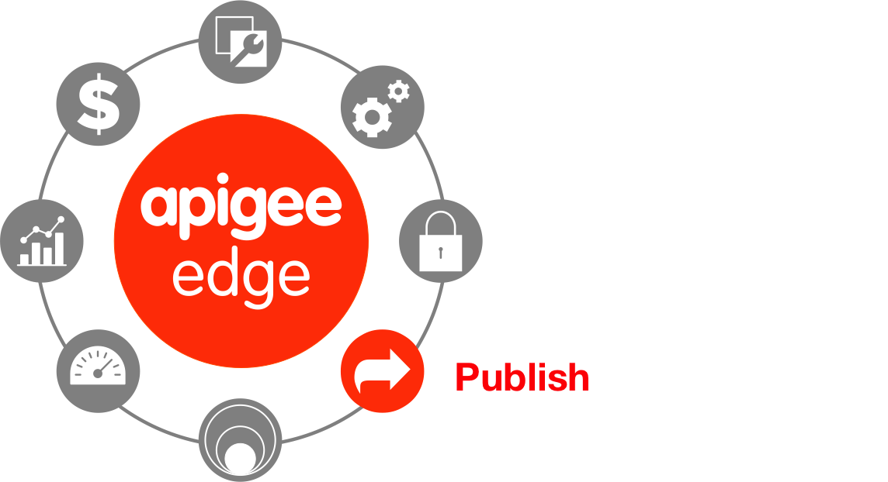

## Objectives

The goal of this exercise is to publish the APIs that are being managed in Apigee Edge. 

Publishing APIs can be broadly defined by the following tasks:

1.  Create the API products on Edge that bundle your APIs.
2.  Register app developers on Edge.
3.  Register apps on Edge.
4.  Provide documentation and community support for your APIs,
    including:
    -   API reference documentation
    -   Examples and tutorials
    -   Forums, blogs, and other features to foster the developer
        community

In this exercise, we'll do all of these things.

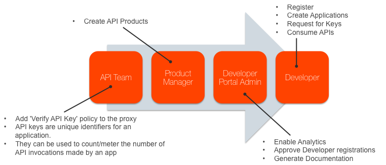

The total estimated time required for this exercise: 60 minutes.

## Prerequisites

-   At a minimum, Lab 2 is completed
-   A developer portal is provisioned


## Part 1: Adding API Key Verification

A *developer* builds an *app* that makes requests to your *APIs* to
access your backend services. The following image shows the relationship
of a developer to an app and to an API:

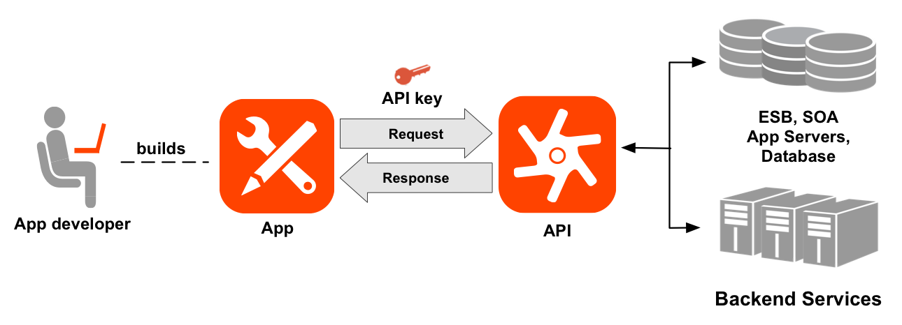

**Estimated Time: 5 minutes**

1. Go to the Apigee Edge Management UI browser tab.

2. Ensure you're viewing the list of API Proxies.  If not, Use the upper navbar to select "API Proxies".  


3. From the list of proxies, Click the name of *your* API proxy.

4. Click on the develop tab


5. Click on Proxy Endpoints -> PreFlow
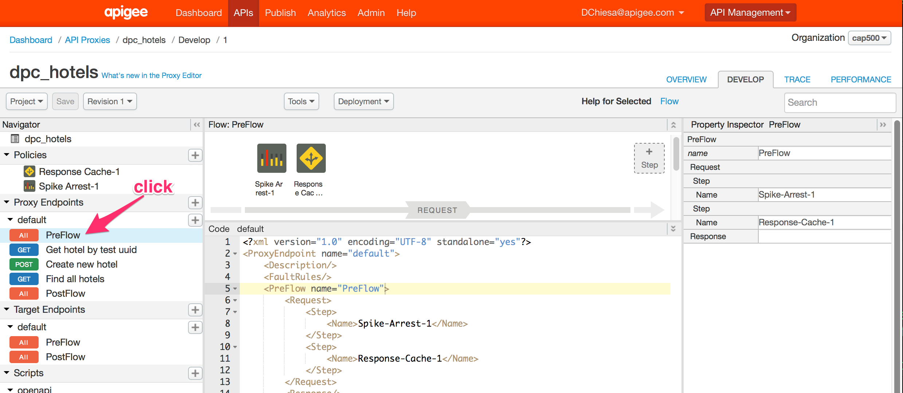

6. Click on “+ Step” on the Request Flow
  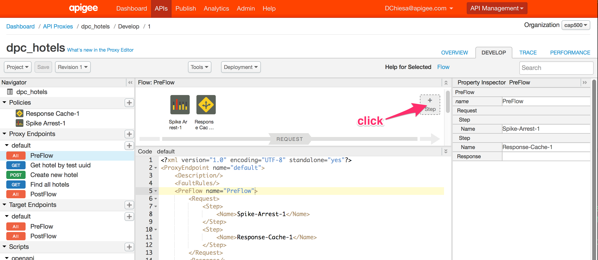
  
  You will see the familiar modal dialog:
  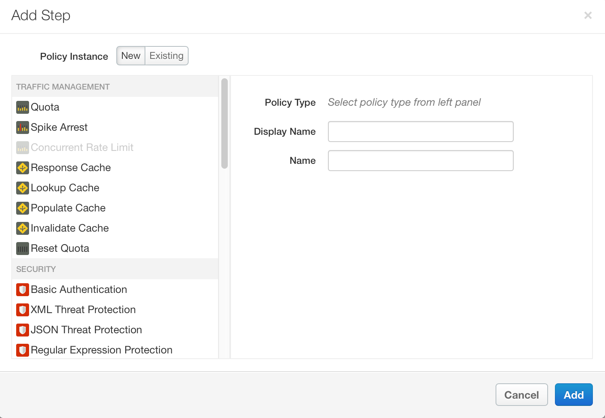
  
7. Scroll down and Select the **Verify API Key** policy, and click the "Add" button. 

  You will then be back in the Develop page.  You will see that **Verify
  API Key** policy has been added after the ‘Response Cache’
  policy. Like so:
  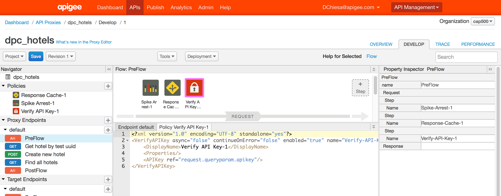

  **Click-and-Drag** the **Verify API Key** policy to move it so
  that it appears before the ResponseCache policy. 
  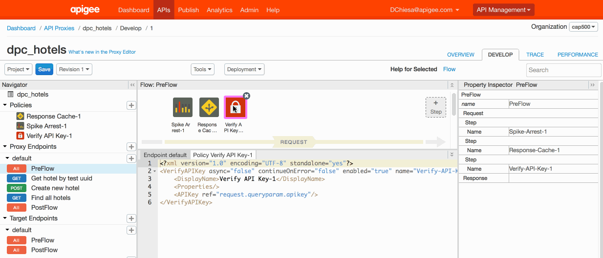

  **Note**: It depends on your use case, but typically API Key
  (or token) verification should be one of the first policies in the flow. In this
  scenario, we verify the API Key before the Response Cache policy to
  ensure that an API Consumer whose API Key may have been revoked is not
  able to get the data from the cache.

8. Ensure you have the correct policy selected. Your view should be like so:
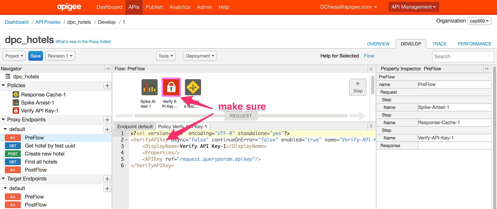

9. Configure the VerifyApiKey policy XML like so:
  ```xml
  <VerifyAPIKey name="Verify-API-Key-1">
      <DisplayName>Verify API Key-1</DisplayName>
      <APIKey ref="request.queryparam.apikey"/>
  </VerifyAPIKey>
  ```
  
  (You can cut-and-paste the above into the policy XML editor)

  Note the `<APIKey...>` element, which identifies where the policy
  should check for the API key. In this example, the policy looks for
  the API key in a query parameter named 'apikey'. API keys can be
  located in a query parameter, a form parameter, or an HTTP header.
  You need only to use a different expression to reference an apikey in
  these different locations. For example, `request.header.key` or
  `request.formparam.apikey`. Also, the header, query parameter, or form
  parameter doesn't have to be named "apikey". Name it whatever you
  like.

  For more, see [the documentation on the Verify API Key
  policy](http://apigee.com/docs/api-services/reference/verify-api-key-policy).

10. Save the API Proxy.


## Part 2: Removing the API Key from the Query String

**Estimated Time: 3 minutes**

Apigee Edge acts as an http proxy. If all of the traffic management and key
verification policies pass, then a *copy of* the inbound request is sent
to the backend. This includes all of the headers and query parameters
that were originally sent in. In many cases you'd like to modify the
copy of the request message before it gets proxied to the backend -
for example, you may wish to inject a header with some client
information. In this case, we will remove information from the
request; we will remove the API Key. The API Key should be considered
a secret, and need not be sent to the backend. Let's remove it.

We'll do that with a particular policy in Apigee Edge known as
`AssignMessage`. The name implies "assign something to a new message
variable", and the `AssignMessage` policy *can* do that.  But it can
also do other things, for example, modify an existing message, by adding
or removing query parameters, headers, and so on. We will use
`AssignMessage` to remove a query parameter.

1. In the API Proxy Editor, Click on “+ Step” on the Request Pre-Flow.  
  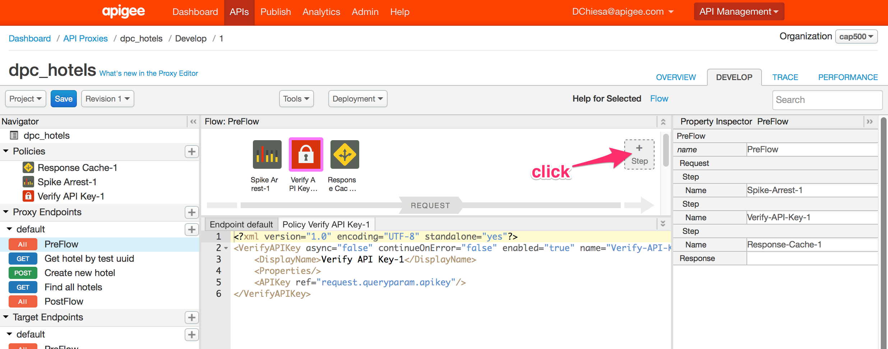

2. From the modal, scroll and select the ‘Assign Message’ policy. Click
  "Add". You will now see something like the following:  
  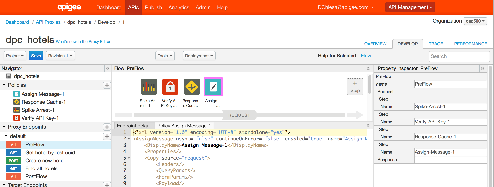

3. Click-and-drag the `AssignMessage` policy so that it appears before the
  Response Cache policy:  
  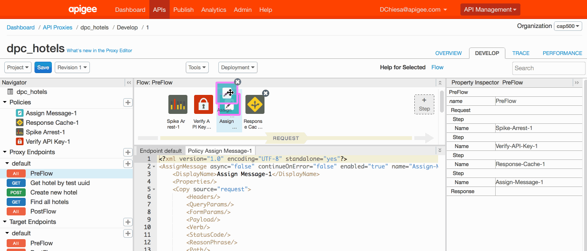

4. Now, verify that you have selected the appropriate policy.  
  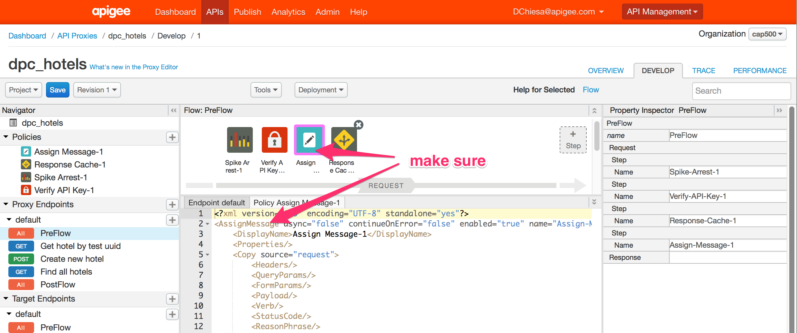

5. Replace the policy XML for the AssignMessage policy with the following:
  ```xml
  <AssignMessage name="Remove-APIKey-QP">
    <DisplayName>Remove APIKey QP</DisplayName>
    <Remove>
      <QueryParams>
        <QueryParam name="apikey"></QueryParam>
      </QueryParams>
    </Remove>
    <IgnoreUnresolvedVariables>true</IgnoreUnresolvedVariables>
    <AssignTo createNew="false" transport="http" type="request"/>
  </AssignMessage>
  ```
  
  This tells Apigee Edge to remove the queryparam "apikey" from the copy
  of the request message that will be sent to the backend.  You could
  also use this policy to remove other information, or to insert
  information into the request.

  You may notice that by applying this XML, we are implicitly changing
  the name and display name of this AssignMessage policy. Just sayin.
    
6. **Save** the API proxy configuration.

  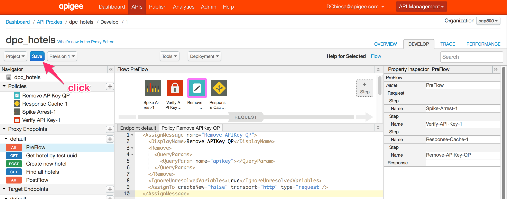

  Because we have added a policy, Edge will increment the revision
  number, and will ask you to confirm this.  Click "Save as New
  Revision" when prompted.
  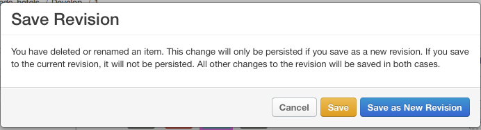


7. You will now have two revisions of the API Proxy.

  The revision dropdown in the UI allows you to select between them. 
  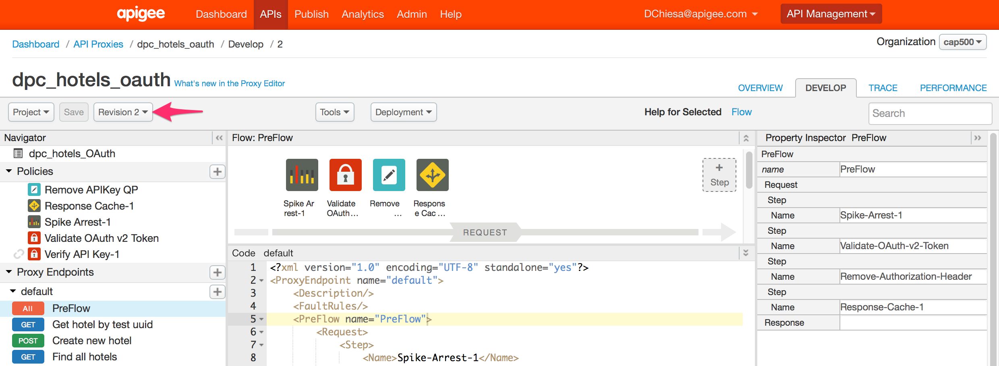
  
  In fact Edge can track many revsions of the same API proxy. This is
  handy if you're interactively experimenting with different logic or
  policy configuration. It's easy to flip back and forth between
  different revisions.
  
  You shouldn't think of Edge as a source-code management system - don't
  think of the revisions as "commits" in the git style. They're just
  distinct versions of the proxy. You will want to manage your
  configuration in a real source-code management system. But that is out
  of scope for this exercise.

  For now, we want to make sure the latest revision is deployed.  Select
  revision 1, then undeploy it.  Then select revision 2 and deploy it.
  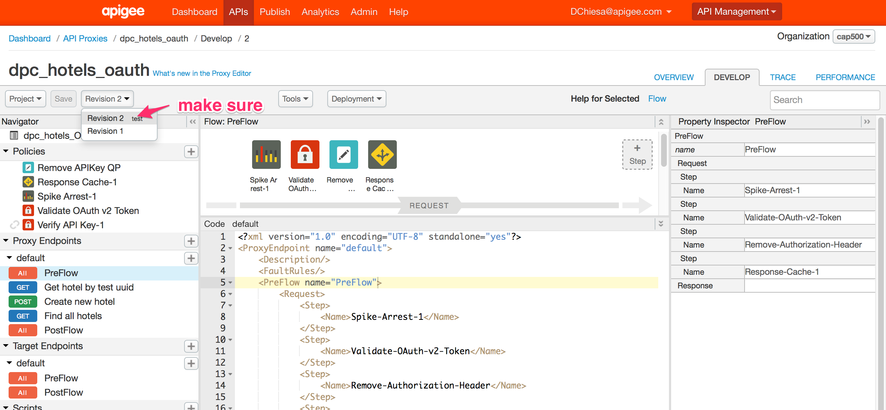
  

## Part 3: Testing API Key Verification

**Estimated Time: 4 minutes**

Until now anyone with the URL to the ‘{your\_initials}\_hotel’ API Proxy
has been able to make a request and get a valid response back (assuming
appropriate input parameters like zipcode and range, of course). Now
that you have added the API Key Verification policy, that will no longer
be the case. Let's check it out.

1. In the Edge UI, select the Trace tab.
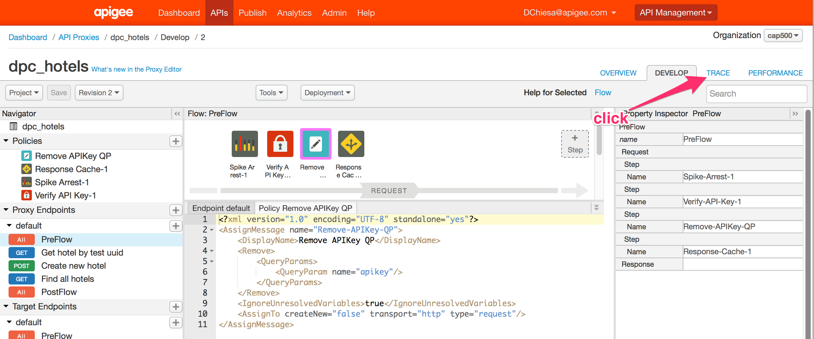

2. Start the Trace session for the ‘**{your\_initials}**\_hotels’
proxy. 

3. Use your Postman client to send a `/GET hotels` request. Use the following
  query parameters: `zipcode=98101&radius=200`

4. In Postman, examine the response. The following fault is returned
  since an API Key has not been provided as a request query parameter:

  ```json
  {
    "fault": {
      "faultstring": "Failed to resolve API Key variable request.queryparam.apikey",
      "detail": {
        "errorcode": "steps.oauth.v2.FailedToResolveAPIKey"
      }
    }
  }
  ```

  The above response shows that the API Key Verification policy is being enforced as expected.

5. Use your Postman client to send another `/GET hotels` request. Use the following
  query parameters: `zipcode=98101&radius=200&apikey=abcdefg`

  This passes an invalid API Key. Examine the response in Postman. It's similar, but not the same. 
  
  NB: It is possible to customize the fault messages that are sent back by Apigee Edge
  when a key is not present, or is invalid. 


6. Return to the Trace screen in the Edge UI.  Click through the
  transactions, and you will see that the Verify API Key policy is
  returning the fault, as expected. 

7. Stop the Trace session for the proxy

Before we can check the positive case, in which the Verify API Key
policy succeeds, we need to issue an API Key. And for that, we need an
API Product. 


## Part 4: API Products

**Estimated Time: 4 minutes**

In Apigee Edge, the API Product  is the unit of exposure.  You should
think of API Proxies as the *unit of execution* and API Products as the *unit of
exposure*.  The Proxy is where you define which operations should occur on
requests and responses. The Product is the thing that consuming developers
get authorization for. 

A simple way to think of an API Product is as a bundle of one or more API
Proxies, along with some meta-data.  For example, the metadata might include a
quota threshold, or a cache lifetime, or a list of data fields to include or
exclude from the response. 

API products enable you to bundle and distribute your APIs to multiple classes
of developer (eg, Gold, SIlver, Bronze) simultaneously, without having to modify
code. An API product consists of a list of API resources (URIs) combined with a
Service Plan (rate-limiting policy settings) plus any custom metadata required
by the API provider. API products provide the basis for access control in
Apigee, since they provide control over the set of API resources that apps are
allowed to consume.

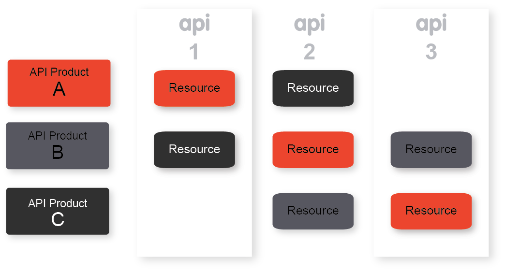

As part of the app provisioning workflow, a developer selects from a list of API
products. This selection of an API product is usually made in the context of a
developer portal. The developer app is provisioned with a key and secret
(generated by and stored on Apigee Edge) that enable the app to access the URIs
bundled in the selected API product. To access API resources bundled in an API
product, the app must present the API key issued by Apigee Edge. Apigee Edge
will resolve the key that is presented against an API product, and then check
associated API resources and quota settings.

The API supports multiple API products per app key - your developers can consume
multiple API products without requiring multiple keys. Also, a key can be
'promoted' from one API product to another. This enables you to promote
developers from 'free' to 'premium' API products seamlessly and without user
interruption. They can continue to use the same key. 

The following table defines some of the terms used to register apps
and generate keys:

| Entity      | Description |
| :---------  | :--------   |
| API product | A bundle of API proxies combined with a service plan that sets limits on access to those APIs, as well as other metadata. API products are the central mechanism that Apigee Edge uses for authorization and access control to your APIs. For more, see [API Products](http://apigee.com/docs/developer-services/content/what-api-product) |
| Developer   | The API consumer. Developers write apps the make requests to your APIs. The developer gets authorization to use one or more *API Products*. |
| App         | A client-side app that a developer registers to access an API product. Registering the app with the API product generates the API key for accessing the APIs in that product. |
| API key     | An opaque string that is generated and stored by Apigee Edge. This key is shared between the app developer and Edge. The app typically sends the API key in with each request, to allow Edge to verify the request. The key is a secret. The API key is generated when a registered app is associated with an API product. |

Now, let's create an API Product within Apigee Edge. 

1. From the Apigee Edge Management UI, click the upper navbar to Publish → Products
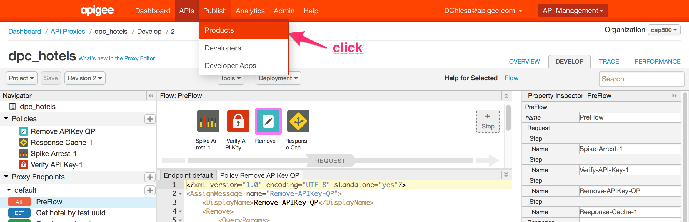

2. Click on ‘+ Product’ button to add a new API Product
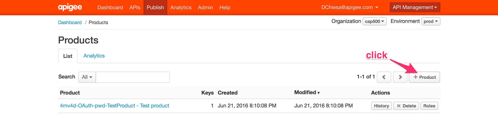

3. In the ‘Product Details’ section of the new product screen, enter or select the following values for the various fields:

  * Display Name: **{Your_Initials}_Hospitality Basic Product**
  * Description: **API Bundle for a basic Hospitality App.**
  * Environment: **test**
  * Access: **Public**
  * Key Approval Type: **Automatic**

  So far, it should look like this:
  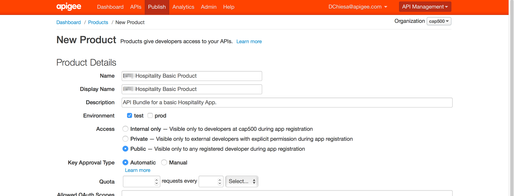

4. Scroll down and click "+ API Proxy"
  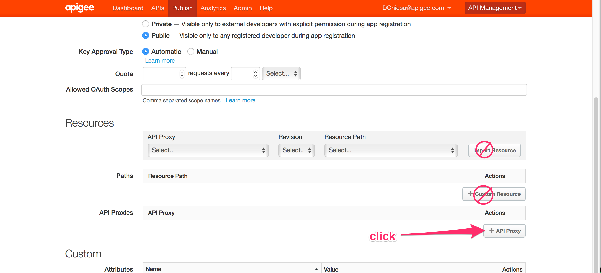

5. In the dropdown, select *your* API proxy, the one named with your initials. 

5. Click **Save** to save the API Product. The new product should now be listed on the ‘Products’ page.


You noticed the UI for adding resources, so let's explain a little about proxies
and resources.  Suppose you had an API Proxy that handled requests on `/hotels`
and `/attractions` . We call these things "resources" in the lingo of REST. You
could configure an API Product to allow access to a subset of the resources
available within a proxy. To do so, you would use those other parts of the User
Interface.

This is a more advanced topic, and we won't explore it further in this exercise. 


## Part 5: The Developer Portal

**Estimated Time: 4 minutes**

Developer portals with social publishing features are used to enaable and engage
the community of developers that consume the APIs you expose. The idea is to
provide an immersive developer experience, so people can use a developer-oriented website to:

* understand the APIs available
* quickly learn how to use them, via interactive documentation
* self-provision access (get keys)
* obtain sample code
* network with each other. Ask and answer questions, share suggestions and working code. 

A developer portal may also publish static content, such as API documentation
and terms-of-use, as well as dynamic community-contributed content like blogs
and forums.

To fulfill the promise of APIs - which is more apps being built more quickly,
more experimentation and more iteration, API Publishers need a way to expose
APIs, educate developers about APIs, sign up developers, and so on. And it's
better to configure a pre-built developer portal rather than try to build one
yourself.

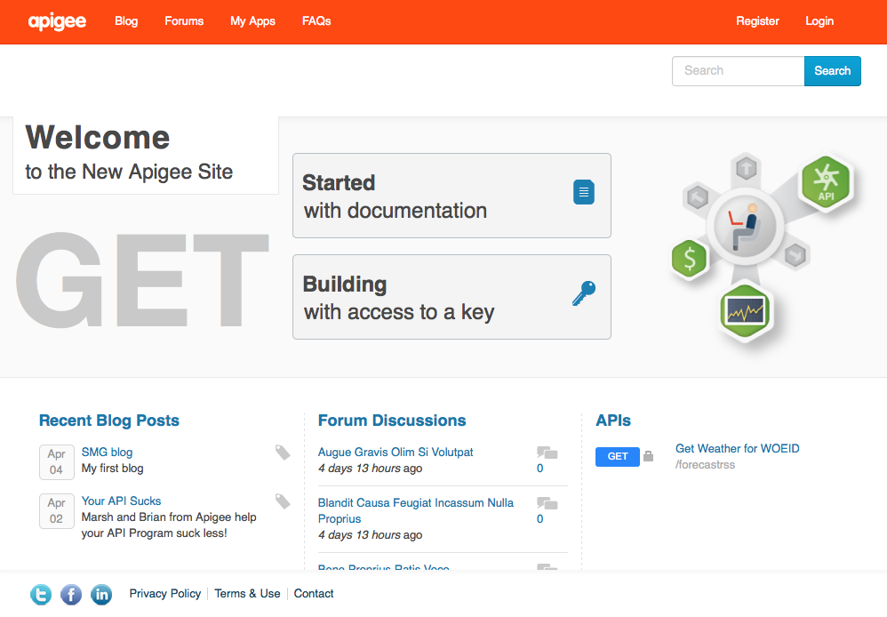

### Configuring the Developer Portal

Developers build apps that access your APIs. When the developer registers an
app, they receive one or more API keys; each key may get embedded into an app,
to allow the app to access all of the API products associated with the
app. Think of the key as "application credential" or a "client credential"; a
thing that proves the identity of the app.

Before getting keys, developers register themselves with the developer
portal. The developer portal is the second of the two primary user interfaces
for Apigee Edge.

1. Ask your instructor for the URL for the developer portal. Visit that page in your browser. 
  On the developer portal home page, select **Register**:  
  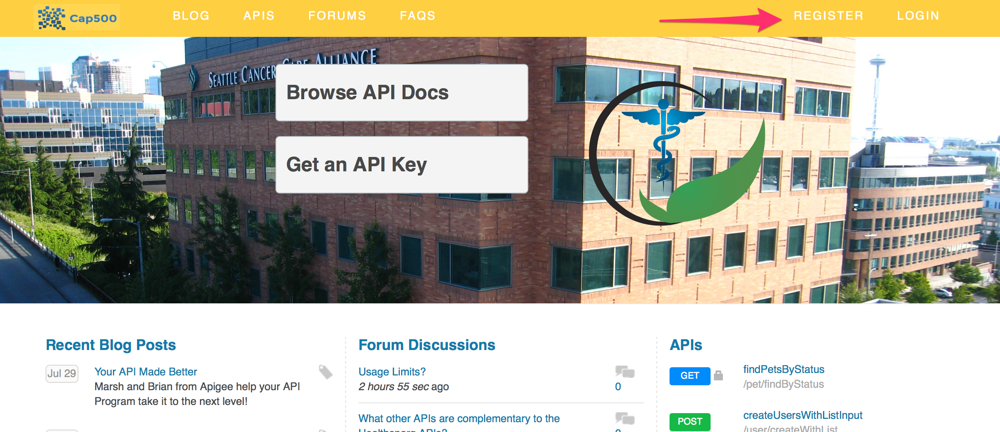

2. Enter the required information and click **Create new account**. Depending on
  the new account registration settings, when the new account is created, you
  could be sent an automated welcome email.

  **NOTE**: If you see this message:  
  

  ...then the developer portal administrator MUST approve the developer before
  the developer can sign in. If you see this message ask your instructor to
  approve your developer account - once that is done then login to the portal.

  > NB: In some "closed" or "restricted" API programs, in which the consumer
    developers are part of a known organization, it may be that you would like
    to not require developers to register on the developer portal site. No
    problem. The developer portal supports an external authentication - you can
    use an external LDAP Server, SAML, OpenID Connect, or some other mechanism.

    This could be used to give employees and trusted partners a "single sign on"
    experience. They'd just visit the dev portal and would automatically be
    recognized and authenticated. 

3. Register an app from the developer portal.   

  Developers register apps to access your API products. When a developer
  registers an app, the developer selects the API products to associate with the
  app and Edge generates an API key. Each app has at least one API key that provides
  access to all API products associated with the app.
  
  Apps allow you to control who can access your APIs. You can revoke an app's
  key, preventing it from accessing all API products. Or you can revoke access
  to a single API product associated with the app.
  
  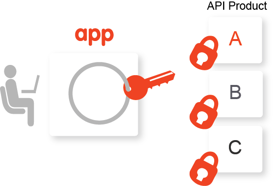

4.  Select **My apps** below your username in the login menu

  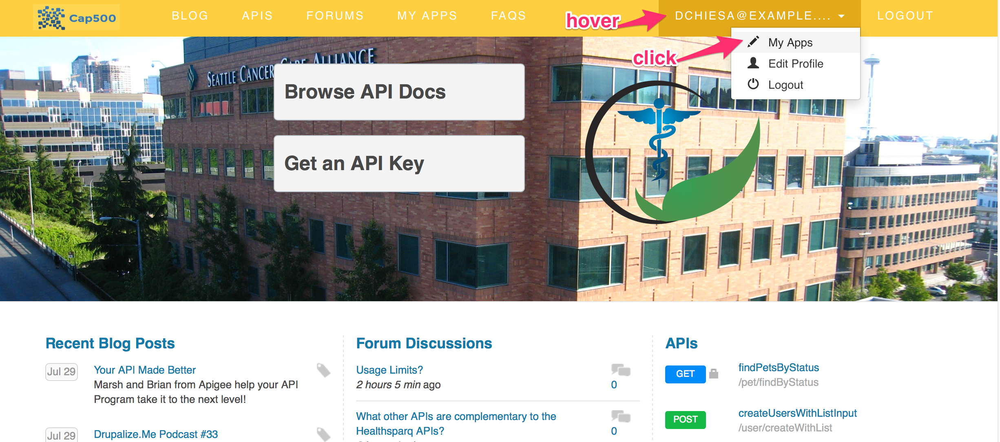

5. Click the **+ Add a new App** icon.

6. Enter details for the application. You will want to select your own API Product.

   The callback URL applies only with APIs that require 3-legged OAuth. We're not
   using that in this exercise, so you can leave the callback URL blank.  In
   a finished devportal, you would probably suppress that field for API Products
   that don't require it. 

   After you're finished, click **Create App**.

7. When the app is created, you'll see a widget on the screen with the name of the app.
  Click it to open an accordion that shows the details of the app, including the
  Consumer Key (aka API Key) and Consumer Secret.

  The Consumer Secret is required only when the API uses
  OAuth 2.0. We're not doing that in this exercise, so you won't need it. 
  Once again, this is something you would hide if the API Product didn't need it. 

  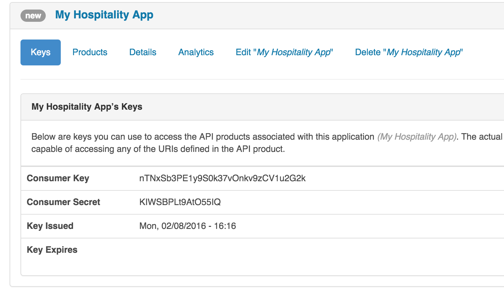

8. Check the API Product and key in the Edge Administrative UI.

  a. Return to the browser tab that shows the Edge Administrative UI.

  b. Use the top navbar to click Publish... Products

  c. Click the link for *your* API product.

  d. In the resulting page, scroll down. You should see an App listed for that product.
     This indicates that a developer has registered an app for the given product.

     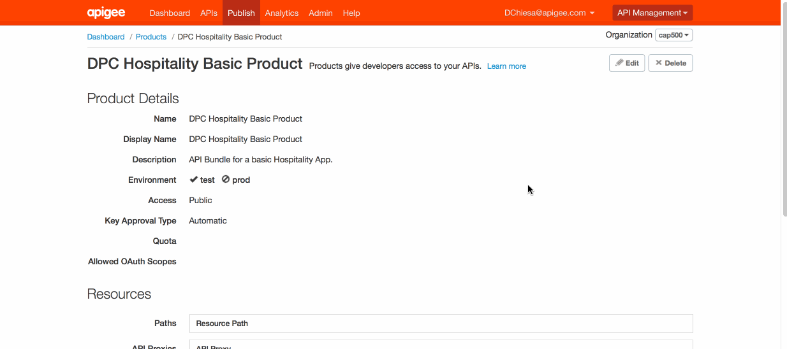


9. Click the link for the app listed there. You will see the details for the app
  that was just registered by a developer on the devportal site.

  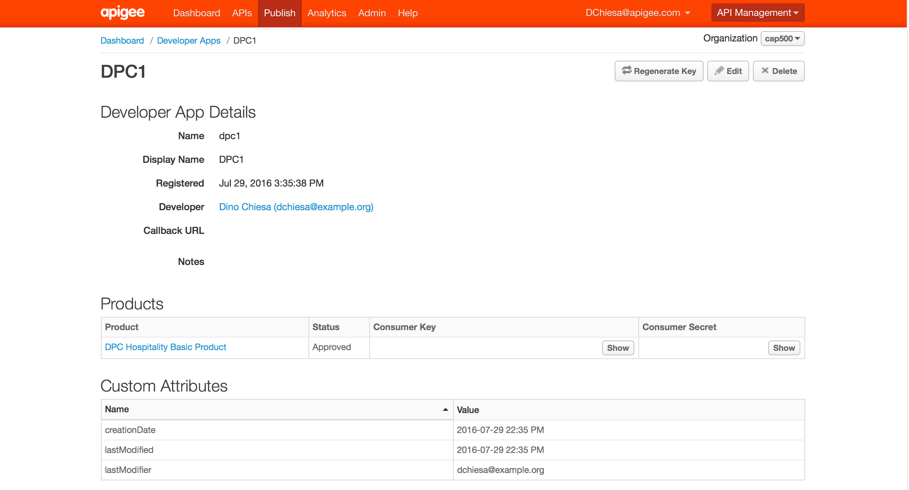


10. Test the API.

  Now that you have a valid API Key, you should be able to test the behavior of
  the Verify API Key policy.
  
  a. Return to the Edge UI.  Be sure to select your API Proxy. Click the Trace tab.
     Then Start a Trace session for your proxy.

  b. From the devportal tab, copy (Ctrl-C) the Consumer Key string. (NOT the Consumer Secret.)

  c. From Postman send the ‘/GET hotels’ request, with the following query parameters:  
    `zipcode=98101&radius=200&apikey={apikey}`

    Replace the apikey query param with your actual apikey, aka Consumer Key.

  d. You should see a successful response.

  e. Now change the API key - add or remove a character or two. Invoke the request again.
    You should see the call be rejected. 


This demonstrates a marvelous capability of the Developer Portal.  Developers
can *self-provision* keys for APIs, and can get started invoking those APIs
immediately.

The API Publishing team can, at their discretion, configure the developer portal
to require manual approval for key requests. And, it's also possible to require
manual approval for some APIs, and automatic approval for others.

The Apigee Edge developer portal also supports role-based access to API
products, so that not all developers would see all API products.

There's great flexibility in the developer portal, and it ought to be suited to
your needs for publishing APIs, whether your requirements are simple or complex.


## Part 6: Publishing API Documentation

We have seen how developers can self-provision keys.  But what about showing
developers the documentation for the APIs, so they know how to invoke them?
Let's explore that now. 


1. Get Authorized

  When you registered on the developer portal, you were assuming the persona of
  a "consumer developer".  To publish API Documentation on the portal, you need
  to be recognized by the devportal as part of the API Publishing team.

  So, as a first step, Ask your instructor to change your developer user to have
  administrator access in the devportal.

2. In the browser tab showing the developer portal, refresh the page.
  You will not have to Logout, and then Signin again.

  You will now notice a black navigation bar at the top of the browser page.
  This is the administrative menu; it is visible only to users who are
  authenticated as administrators on the site. 

3. Create a model

  A model is a description of the API. We have the OpenAPI Spec document that
  describes the API.  Now you'll publish that to the developer portal. 

  a. Using the black navbar at the top of the page, select
    **Content &gt; SmartDocs** . 

    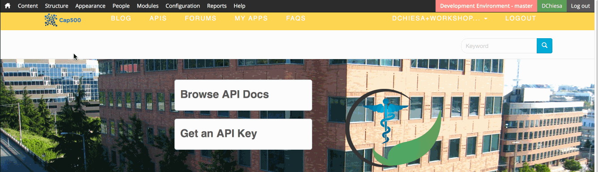

  b. Select **New model** at the top of the page. 

    When you create a model, it's stored in your Edge organization as the source
    for the API structure. For more information, see [*About SmartDocs models and
    templates*](http://apigee.com/docs/developer-services/content/using-smartdocs-document-apis#models).

  c. Enter the following fields:
  
    * **Name**: The model name that will be displayed across the site. Use your initials as a prefix here.

      NB: As you type the **Name**, the internal name
      displays. The internal name for the model that must be unique among all
      models. The internal name must contain only lowercase letters, numbers,
      and hyphens with no spaces. Select **Edit** to edit this name if you
      wish. You probably don't want to.
    
    * **Description**: A description of the model. This will be seen by Consumer Developers,
      so it's helpful to briefly describe what the API is all about. 

      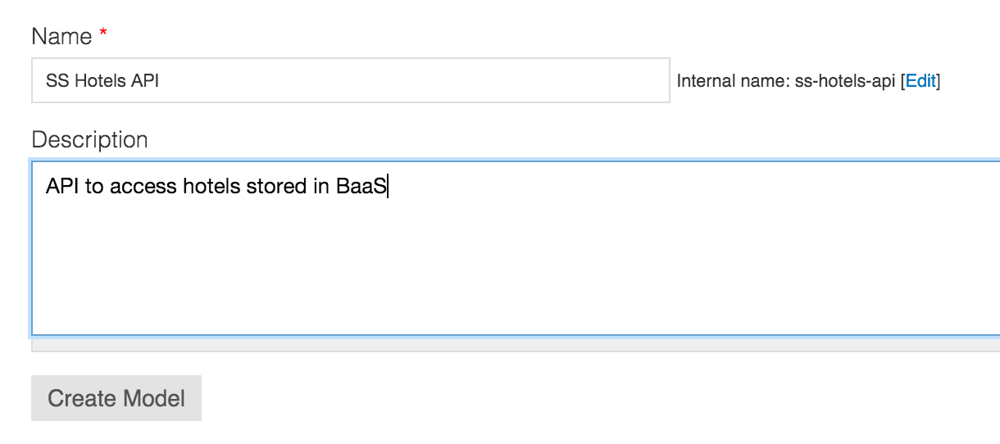

  d. Click **Create Model**

  This creates a named API model, but there's no description attached to that name, just yet.
  Let's do that now. 


4. On the resulting page, click on ‘Import’ to import an API specification. 

5. The API specification can be provided in one of several formats. In this
  exercise, we will use **OpenAPI – YAML**. Select that option.

6. Download the [hotels-openapi.yaml](../../Resources/hotels-openapi.yaml) file to your workstation.

7. Open that file in a text editor and change the basePath on line 14 to match
  the base path of your API proxy. Example: `/v1/dpc_hotels`  
  Save the file. 

8. Back in the developer portal, Click browse to select the YAML file - the one
  you just modified - to upload.  
  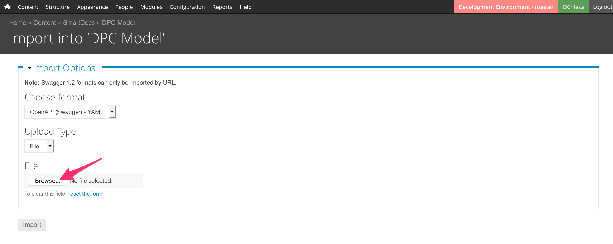

  Click **Import**

9. On the resulting page, you have the option to selectively include or exclude
  particular operations from the generated documentation.  We want to publish complete
  documentation here, so, select all, and click Render and Publish. 

  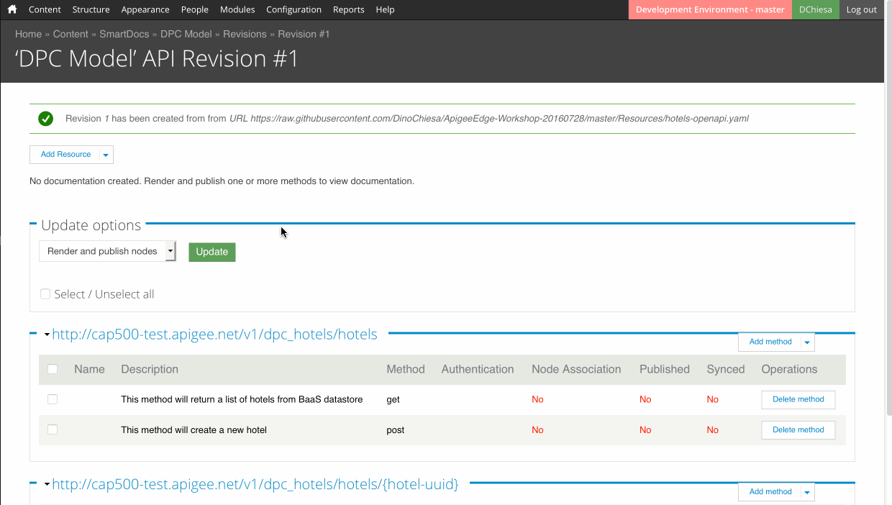
  
  This will create documentation pages for the OpenAPI Specification. 
  

10. After the rendering completes, click on ‘View API Documentation’ to see the
  published documentation.  
  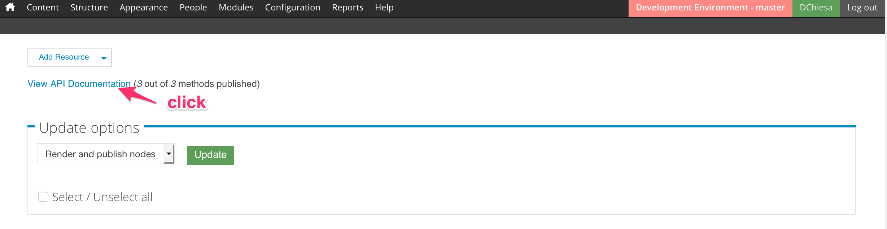

11. This displays an index page for all of the resource + verb pairs that were
  defined in your OpenAPI specification document.
  
  The styling for this index page is configurable.

12. Click on **hotels-get**

  You will see a form that allows you to invoke the API interactively from
  within the browser. Fill out the form. 
  
  a. You can leave the radius and zipcode parameters empty, or you can specify
    values that are appropriate there. 

  b. Enter ‘**application/json**’ as the Content-Type.

  c. Specify the apikey that you obtained as a developer. You can find it via the
    Edge Administrative UI, if necessary. 

  d. Click on ‘**Send this request**’

    You will now see a display of the request that gets sent, and the response
    received.

This is what Apigee calls "Smartdocs". Smart, interactive documentation. There
are other API publishing mechanisms out there - for example there is a framework
called Swagger-UI which will render OpenAPI specification documents into a
single-page web app (SPA) with an accordion UI metaphor. This is really handy
and simple.

One problem with using a single-page web app for documentation is SEO - search
engine optimization.  When a developer searches for a term in your API
documentation, s/he will be directed to the single page. If you have 35
resource+verb pairs rendered in accordions, the consumer developer will be
forced to manually search to find the topic of interest.

Smartdocs purposefully avoids that by rendering a unique, search-indexable page
for each resource + verb pair in the API. This allows search to work properly,
which makes it much nicer for developers.

Smartdocs offers some other advantages - in particular it stores state in
browser local storage, so that fields can be automatically re-populated if a
developer returns to the same API documentation.

But there are a few extra steps when you publish Smartdocs. Therefore, the
choice is up to you: you can choose Smartdocs, or Swagger-UI, or some other
documentation rendering mechanism.  

## Next Steps

After rendering SmartDocs, the next step is to embed the links to these
generated doc pages into the other pages of the developer portal.

The links for your published SmartDocs will automatically be included into the
index page.

In the Developer Portal, click the APIs link in the top navbar, and you
should see a page that shows the smartdocs.  In a real developer portal, you may wish to augment 
that list with some other guidance information about the
APIs available on your portal. We won't do that in this exercise. 

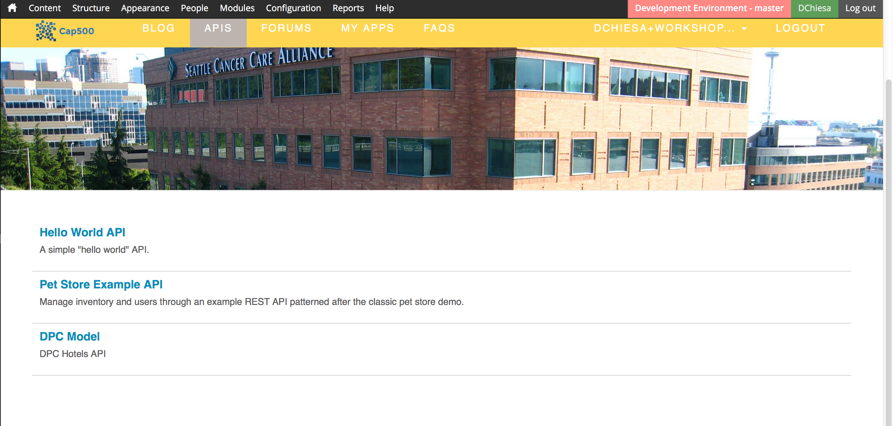

## Summary Notes

In this exercise, you learned:

* How API keys can be used as an application
identifier, or client credential.

* How APIs can be packaged into API Products.

* The purpose and function of the Apigee Edge  developer portal

* How developers are onboarded and how developer applications are registered.

* How to publish API documentation to the developer portal

* How the interactive documentation called "Smartdocs" works

