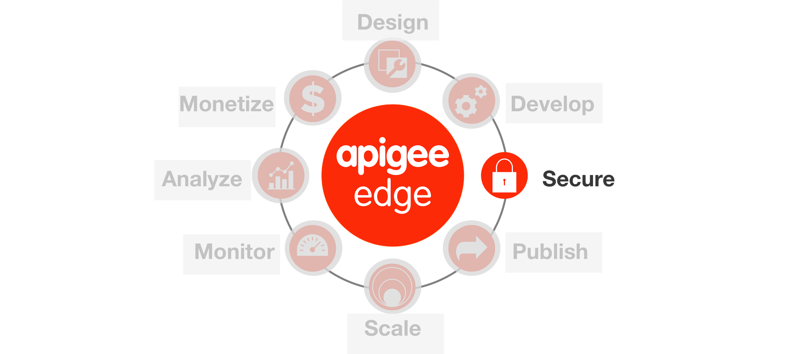

# Securiing APIs with OAuth



## Objective

The objective of this lesson is to learn to use Apigee Edge
OAuth 2.0 Token Validation policies.

In the earlier lab, we saw how API Keys help in identifying the
consumer. Identifying an API consumer is beneficial from an analytics
and audit perspective, but in many situations, simply identifying the
API consumer is not secure enough. To add an additional level of
security, in this lesson you will replace the API Key Verification
policy with an OAuth 2.0 Token Validation policy using the
client-credentials two-legged OAuth flow.

**Estimated Time for this exercise: 60 minutes**

## Prerequisites

-   At a minimum, Lab 3 is completed.
-   A preliminary understanding of OAuth 2.0.
-   Apigee OAuth proxy deployed to your organization. (Your instructor normally does this.)


## Part 1: Overview

**Estimated Time: 10 minutes (reading)**

There are many out-of-the-box security policies that Apigee Edge
provides to protect your APIs. These security policies must be used
appropriately based upon your use cases. Apigee Edge supports:

### API Key Security

API key validation is the simplest form of app-based security that you
can configure for an API. Apps simply present an API key, and Apigee
Edge checks to see that the API key is in an approved state for the
resource being requested.

The security associated with API keys is limited. API keys can easily be
extracted from app code and used to access an API. You may find that API keys
work better as unique app identifiers than as security tokens. For more
information, see [API
Keys](http://apigee.com/docs/api-services/content/api-keys).

### OAuth v2.0

Here's the definition of OAuth from the OAuth 2.0 IETF specification:

> The OAuth 2.0 authorization framework enables a third-party application to
obtain limited access to an HTTP service, either on behalf of a resource owner
by orchestrating an approval interaction between the resource owner and the HTTP
service, or by allowing the third-party application to obtain access on its own
behalf.

All requests from the app for protected resources from the backend service is
negotiated using an access token. Access tokens are strings, typically opaque
strings, generated by an authorization server after appropriate app and/or user
credentials are presented. Tokens are used to validate requests for protected
resources. If an app is compromised, the resource server can revoke its access
token. In that case, the end user does not need to change her username/password
on the resource server, her app simply needs to request a new access
token.

To go beyond app identification using API Keys, Apigee Edge provides
comprehensive support for OAuth v2.0. Apigee Edge includes an OAuth
2.0 authorization server implementation that lets you register apps
and secure API proxies with OAuth 2.0 using the four grant types that
are part of OAuth 2.0. For more information, see [OAuth 2.0
](http://apigee.com/docs/api-services/content/oauth-introduction)and
the [OAuth the Big
Picture](http://apigee.com/about/blog/technology/oauth-big-picture-free-ebook) Apigee
eBook.

### OAuth v1.0a

OAuth 1.0a defines a standard protocol that enables app users to
authorize apps to consume APIs on their behalf, without requiring app
users to disclose their passwords to the app in the process. Apigee
Edge enables you to protect APIs in a way that ensures that an app
uses has authorized the app to consume an API. Edge also provides
policy-based functionality for configuring the endpoints that app
developers can use to obtain access tokens. For more information, see
[OAuth
v1.0a](http://apigee.com/docs/api-services/reference/oauth-10-policy)
policy.

### SAML

Apigee Edge enables you to authenticate and authorize apps that are
capable of presenting SAML tokens. A SAML token is a digitally signed
fragment of XML that presents a set of "assertions". These assertions
can be used to enforce authentication and authorization.

To use SAML terminology, Apigee Edge can function as a service
provider (SP) or an Identity Provider (IP). When Apigee Edge validates
SAML tokens on inbound requests from apps, it acts in the role of SP.
(API Services can also act in the IP role, when generating SAML tokens
to be used when communicating with backend services. For details on
SAML validation, see [SAML Assertion
policies](http://apigee.com/docs/api-services/reference/saml-assertion-policy).

## Content Based Security

Message content is a significant attack vector used by malicious API
consumers. API Services provides a set of Policy types to mitigate the
potential for your backend services to be compromised by attackers or
by malformed request payloads.

### JSON threat protection

JSON attacks attempt to use structures that overwhelm JSON parsers to
crash a service and induce application-level denial-of-service
attacks.

Such attacks can be mitigated using the JSONThreatProtection Policy
type.

See [JSON Threat Protection
policy](http://apigee.com/docs/api-services/reference/json-threat-protection-policy).

### XML threat protection

XML attacks attempt to use structures that overwhelm XML parsers to
crash a service and induce application-level denial-of-service
attacks.

Such attacks can be mitigated using the XMLThreatProtection Policy
type.

See [XML Threat Protection
policy](http://apigee.com/docs/api-services/reference/xml-threat-protection-policy).

### General content protection

Some content-based attacks use specific constructs in HTTP headers,
query parameters, or payload content to attempt to execute code. An
example is SQL-injection attacks. Such attacks can be mitigated using
the Regular Expression Protection Policy type.

See [Regular Expression Protection
policy](http://apigee.com/docs/api-services/reference/regular-expression-protection).

### Data Masking

Apigee Edge enables developers to capture message content to enable
runtime debugging of APIs calls. In many cases, API traffic contains
sensitive data, such credit cards or personally identifiable health
information (PHI) that needs to filtered out of the captured message
content.

To meet this requirement, Edge defines 'mask configurations' that
enable you to specify data that will be filtered out of trace
sessions. Masking configurations can be set globally (at the
organization-level) or locally (at the API proxy level). Role-based
capabilities govern which users have access to the data that is
defined as sensitive.

For more information, see [Data
Masking](http://apigee.com/docs/api-services/content/data-masking)[
](http://apigee.com/docs/api-services/content/data-masking)[](http://apigee.com/docs/api-services/content/data-masking)

[](http://apigee.com/docs/api-services/content/data-masking)


## Part 2: OAuth 2.0 Token Verification

**Estimated Time: 10 minutes**

The way your API Proxy is configured now, the app must present the Consumer Key,
also known as the API Key, in a query parameter, to access the proxy
resources. We will create a modified version of this API Proxy that accepts only
OAuth tokens, presented in the Authorization header.

There are two steps that an app must perform in order to use APIs protected by
OAuth tokens. First the app needs to obtain a token; usually this involves a POST
request to a `/token` endpoint. Then, it sends the received token with every
request in the `Authorization` header.

### Preparation

1. Before proceeding, let's preserve the state of the API Proxy you have working
  now. We will do that by copying your existing API Proxy to a new one.

  a. First, use the Edge UI to navigate to your API Proxy.  
    
    
  b. Under the Project dropdown, click "Save as New API Proxy"
    

  c. name your new API Proxy with an _oauth suffix. For example, if your
    prior proxy was named `dpc_hotels`, then name the new one, `dpc_hotels_oauth`.

2. Modify the base settings for the API Proxy

  a. click the `Develop` tab.
    

  b. click the API Proxy name
    

  c. Modify the Display Name to include the word "OAuth", to reflect the purpose of this proxy.

  d. Then, click the Proxy Endpoint named "default"
    

  e. Append the suffix "_oauth" to the basepath. Case matters. 
    

    This will change the base url path at which the API Proxy listens. 

  f. Click the blue "Save" button.

  You have now saved a new API proxy, with a new basepath, and a new name and display name. 

  For consideration and discussion: why did we need to modify the basepath of this proxy?
  

### About OAuth2.0 Grant Types and Apigee Edge

In Apigee Edge, API Publishers have full control over how OAuth tokens are
issued. There are four "grant types" described in the [OAuth 2.0 specification](https://tools.ietf.org/html/rfc6749):

| grant_type         | Description |
| :----------------- | :----------- |
| client_credentials | Used to request or issue a token that authenticates "a client", which is not associated to a user or person. There is no user authentication. |
| password           | Used to request or issue a token that authenticates both clients and users. The app must pass credentials for both entities to the token server (in our case, Apigee Edge). The token server is responsible for validating both sets of credentials. |
| authorization_code | Used to request or issue a token that authenticates both clients and users. The app passes credentials for itself; the token server redirects the app to a login webpage, where the user will be authenticated. This avoids the need for the user to send user credentials to the token server, which may be untrusted from the user's perspective. Through a 302-redirect, the app exchanges an authorization code for a token. Hence, the name of the grant type. |
| implicit           | Used for a simpler approach to oauthorization_code grants, when the client is trusted. |


You should think of each grant type as a different way that an OAuth token can
be requested and issued. As you can see, different grant types apply to
different scenarios.

Apigee Edge can issue OAuth 2.0 tokens according to any of these grant types.

In Apigee Edge, token issuance is under full control of the API Publishers.  In
fact, API Publishers must expose a `/token` endpoint to issue tokens, and must
configure the API Proxy to perform the steps required to issue the tokens.

If the API Publisher wishes to issue tokens according to the implicit
grant_type, then, the API Publisher must configure the API Proxy appropriately.
If the API Publisher wishes to issue tokens according to the client_credentials
grant_type, then, likewise. Apigee Edge does not issue tokens "by default".
Enabling Apigee Edge to issue tokens requires configuration by the API
Publishing team.

### Let's talk about Client Credentials

The client credentials grant type defines a procedure for issuing
access tokens in exchange for *App credentials*. These app credentials
are the consumer key and secret pair that Apigee Edge issues for each
app that is registered in an organization.

In the client_credentials grant type, the token server verifies the credentials
of the client (the app), and issues a short-lived token in response. The
credentials are always the tuple of {client_id, client_secret}. Remember, a
token is just a random-looking string.

It's relatively simple to 'step up' your API
security scheme from API key validation to OAuth client credentials.
The difference is that client credentials provides an
extra layer of control, since you can easily revoke an access token
when needed, without requiring you to revoke the app's consumer key.
To work with the default OAuth endpoints, you can use any consumer key
and secret generated for app in your organization to retrieve access
tokens from the token endpoint. 

You should be aware that tokens obtained via the client_credentials grant type
have specific use cases. This grant type does not authenticate the user, which
means it is not commonly used for web and mobile apps.

For a general introduction to OAuth 2.0 grant types with definitions and use
cases, see [Introduction to OAuth
2.0](http://apigee.com/docs/api-services/content/oauth-introduction).


### Modify the API Product to Include the New API Proxy

1. Navigate to the API Products page in the Edge UI, then select
  *your* API Product.
  

2. Click the "Edit" button to modify the API Product
  

3. Click the "+ API Proxy" button.
  

4. Select your new API proxy, with the _oauth suffix.

5. Click "Save" to save the API Product


Now, the API Product includes two API Proxies. 


### Modify the New Proxy to Use Token Validation

1. Add an OAuth 2.0 Token Validation Policy

  a. Go to the Apigee Edge Management UI browser tab

  b. Select your API Proxy and click the Develop tab.
    Ensure you are modifying the API Proxy with the _oauth suffix. 

  c.  Since you will be adding an OAuth v2.0 policy, the API Key
    Verification policy is no longer necessary. Click the proxy Pre-Flow:
    

  d. Delete the ‘Verify API Key’
    policy from the ‘{your_initials}_hotels_oauth’ proxy default proxy endpoint preflow.
    

  e. Click "+Step"
    

  f. In the modal dialog, select the OAuth2.0 policy
    

  g. Click "Add"

    The `Oauth-v20-1` policy will get added after the
    ‘Response Cache’ policy. Drag and move the OAuth v2.0
    policy so that it appears before the ‘Remove APIKey QP’ policy.
    
    
  h. Modify the configuration associated with
    the OAuth v2 policy. It should look like this:

    ```xml
    <OAuthV2 name="Validate-OAuth-v2-Token">
      <DisplayName>Validate OAuth v2 Token</DisplayName>
      <ExternalAuthorization>false</ExternalAuthorization>
      <Operation>VerifyAccessToken</Operation>
      <GenerateResponse enabled="true"/>
    </OAuthV2>
    ```
    
    Note: pasting this configuration in will change the name and display name of
    the policy.
    
    The OAuthV2 policy in Apigee Edge performs many tasks: generating tokens,
    validating tokens, invalidating tokens, and so on. The value of the
    **Operation** element indicates the action to take. In this case, we want
    to verify the access token, so we use `VerifyAccessToken`.

    All of the options for the OAuthV2 policy are described
    [in the documentation](http://docs.apigee.com/api-services/content/oauthv2-policy).


2. Remove the Authorization Header after Validating the OAuth Token

  In the prior version of the API Proxy, we used an `AssignMessage` policy to
  remove the apikey query parameter. Now, we'll modify that policy to remove the
  Authorization header.
  
  a. Click the AssignMessage policy
    

  b. Modify the XML configuration to use this:
  
    ```xml
    <AssignMessage name="Remove-Authorization-Header">
        <Remove>
            <Headers>
                <Header name="Authorization"/>
            </Headers>
        </Remove>
        <IgnoreUnresolvedVariables>true</IgnoreUnresolvedVariables>
        <AssignTo createNew="false" transport="http" type="request"/>
    </AssignMessage>
    ```

  As a security measure, the ‘Remove Authorization Header’ policy removes the
  Authorization header from the HTTP request message so it is not sent to the
  backend service. In fact, if the Authorization header is not removed, the
  Backend-as-a-Service API will throw an invalid token error.

3. Click "Save" to save your API Proxy. Again, you may
   see the new revision popup. You should save a new revision.

4. Use the "Deployment" dropdown to deploy the latest revision this new API Proxy to "test"
  

  If for any reason an older revision of this proxy is deployed, you can use the
  revision dropdown to select older revisions and undeploy them, before
  deploying the latest.


Done! OK, Let's test it. 

### Test OAuth 2.0 Token Validation

1. In the Edge UI, switch to the Trace tab.

2. Start a Trace session for the ‘{your_initials}_hotels_oauth’ proxy

3. Switch to Postman, and invoke the API, as you have done before.
  Remember that the API basepath has changed. You must apply the _oauth suffix
  to your API calls in Postman. 

  Send `/GET hotels` request from Postman with the following query parameters:  
  `zipcode=98101&radius=200`

  You should see a fault:
  
  ```json
  {
    "fault": {
      "faultstring": "Invalid access token",
      "detail": {
        "errorcode": "oauth.v2.InvalidAccessToken"
      }
    }
  }
  ```
  
  This shows that the OAuth2 Verification policy is being enforced as expected.

4. Review the Trace for the proxy and the returned response to ensure
   that the flow is working as expected.
   
5. Stop the Trace session for the ‘{your_initials}_hotels_oauth’ proxy

6. Now, obtain a valid token via client_credentials grant_type.

  Previously we have configured an OAuth-token dispensing proxy into the
  Edge organization. It's ready and available for you to use. 

  You must obtain an OAuth token by calling the ’oauth’ API proxy token endpoint,
  passing the consumer key and consumer secret of the app you have
  registered on the developer portal.

  a. Using Postman, send the `POST /token’ request.
  
    You will need to specify both the consumer_key and consumer_secret (aka client_id
    and client_secret) in the appropriate places in the form body.

    Copy-paste the Consumer Key and Consumer Secret from the
    developer portal, or from the Edge Admin UI. As you copy-paste, remove any
    spaces before and after the values of the Consumer Key and Consumer Secret.

    
    

  b. Review the response of the `POST /token` request. The response should look like this:
    
    

    Or, in json:
    ```json
    {
      "issued_at": 1469852566553,
      "grant_type": "client_credentials",
      "api_product_list": "[DPC Hospitality Basic Product]",
      "expires_in": 1799,
      "client_id": "SKGDyIk9jhAx9qoyekgd4YSjXLcgRoxx",
      "access_token": "I6RPh2jDNx90feGXwZ2nbbTYrrBW",
      "application_name": "dpc2",
      "issued": "2016-Jul-30T04:22:46.553+00:00",
      "expires": "2016-Jul-30T04:52:45.553+00:00",
      "note": "All this metadata is attached to the token in the token store within Edge."
    }    
    ```

    Copy the value of the ‘access_token’ attribute to use in the next step.
    
    BTW, this response gives basic information about the token. Observe the
    access_token and the expiry values - these are the most critical pieces of
    information. You, as API Publisher, have control over how much information
    to return in an OAuth token response. You could simply return the token and
    the expiry, or you could return additional information at your discretion.

    Now, we will use that token in a request.
    

7. Return to the Edge UI and Start a Trace session for the
‘{your_initials}_hotels_oauth’ proxy.

8. Return to Postman, and select the `GET hotels - OAuth` request.
  

9. Specify these values:

  * query parameters: `zipcode=98101&radius=200`
  
  * header: `Authorization: Bearer {access_token}`

    ... but replace the `{access_token}` with your access token obtained from the prior
    step.
    
    

10. Send the request from Postman.

  You should see a success response. 

11. Switch to the Edge UI, and review the Trace for the proxy and the returned
    response to ensure that the flow is working as expected.


## Summary

That completes this hands-on lesson. In this lesson you learned:

- The security policies available in Apigee Edge

- The OAuth grant types, and how Apigee Edge supoprts them

- How API Key verification differs from OAuth token verification

- How to use OAuth Token verification in an Apigee Edge API Proxy. 

